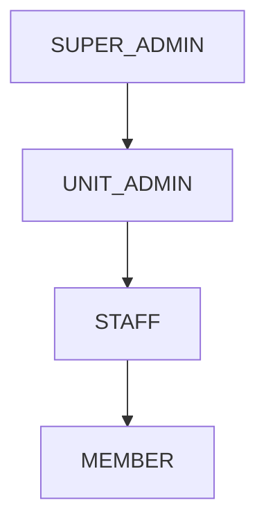

# API Reference

<!-- Copyright 2026 Chronos Ledger Contributors (Apache 2.0) -->

**Machine-readable contract**: [`docs/openapi.yaml`](openapi.yaml): OpenAPI 3.1.

**Interactive UI** (live server): `http://<server>/docs` (Swagger UI) · `http://<server>/redoc` (ReDoc)

Both, and `/openapi.json` with them, follow `DOCS_ENABLED`: off under
`APP_ENV=production` unless you set it, on everywhere else. A production
instance that publishes them hands its whole surface to anybody who finds
the host, so the file above is the contract to work from.

Base URL: `http://<server>/api/v1`

---

## Configuration

### GET /config `[public]`

What a client needs before anyone has logged in: which vocabulary to render,
and how short a password this deployment will accept.

```json
{
  "labels": {
    "staff": "Faculty",
    "member": "Student",
    "activity": "Course",
    "unit": "Department",
    "lead": "Instructor",
    "cycle": "Academic Year"
  },
  "password_min_length": 12
}
```

The label keys are always the same six. Each is set on its own with
`LABEL_STAFF`, `LABEL_MEMBER`, `LABEL_ACTIVITY`, `LABEL_UNIT`, `LABEL_LEAD` or
`LABEL_CYCLE`, and anything left blank comes back as the engine's own neutral
word: `Staff`, `Member`, `Activity`, `Unit`, `Lead`, `Cycle`. There is no
domain preset behind them, so the words above are one deployment's choices and
not a mode you can select. Labels are display only: no field name in this
document changes with them.

Labels change nothing else. The field names in this reference, the database
columns and the CSV headers stay as they are whatever the interface calls them,
so an integration reads `member_id` on a campus and `member_id` in a hospital.
[docs/vocabulary.md](vocabulary.md) is the whole subject, including which value
sets are closed and why.

`password_min_length` follows `PASSWORD_MIN_LENGTH`. Nothing here is a secret:
a caller learns the password floor from a single rejected change anyway.

---

## Authentication

All endpoints except `/auth/login`, `/auth/refresh`, `/auth/logout`, the
`/config` document above and the calendar feed require a Bearer token:

```
Authorization: Bearer <access_token>
```

Access tokens expire after `JWT_ACCESS_TOKEN_EXPIRE_MINUTES` (default: 15).
`POST /auth/refresh` exchanges the refresh token returned by `/auth/login` for a
new pair; refresh tokens are single use and last
`JWT_REFRESH_TOKEN_EXPIRE_DAYS` (default: 30). A used refresh token presented
again more than ten seconds after its use is taken to be in two hands: every
token descended from the same sign-in stops working and the client has to sign
in again. Inside those ten seconds the repeat is refused and nothing else
changes, which is what two tabs refreshing together look like.
`POST /auth/logout` ends the sign-in its refresh token belongs to.

An API key in `X-API-Key` is accepted anywhere a Bearer token is. See
[API keys](#api-keys).

A deactivated account (see `POST /users/{user_id}/deactivate` below) is
refused everywhere. Signing in answers `401 Invalid credentials`, the same as
a wrong password, and an access token issued before the deactivation gets
`401 Account deactivated`. Its API keys are deleted, so one of those gets
`401 Invalid API key`.

### Rate limits

Three routes carry a budget per caller, counted over a fixed window:

| Route                              | Counted per                                  | Default                          |
| ---------------------------------- | -------------------------------------------- | -------------------------------- |
| `POST /auth/login`                 | calling address, and separately the account  | 10 and 5 failures per 15 minutes |
| `POST /guest/register-checkin`     | the account the kiosk's API key belongs to   | 300 per hour                     |
| `GET /sync/user-feed/{token}.ics`  | the feed token                               | 60 per hour                      |

Only failed sign-ins are counted; a correct password costs nothing. Past the
budget the answer is a `429` carrying `Retry-After` in seconds:

```json
{ "detail": "Too many sign-in attempts from this address. Try again in 840 seconds." }
```

Every number is a setting, `RATE_LIMIT_*` in [`.env.example`](../.env.example).
A count of `0` turns that one limiter off and `RATE_LIMIT_ENABLED=false` turns
off all three. The counters live in Redis; an instance that cannot reach Redis
stops applying the limits rather than refusing the requests.

### Role hierarchy



Higher roles inherit the permissions of all roles below them. Role is embedded in the JWT payload and validated server-side on every request.

---

### POST /auth/login

```json
// Request
{ "email": "user@org.internal", "password": "…" }

// Response 200
{
  "access_token": "<jwt>",
  "token_type": "bearer",
  "user_id": "FAC001",
  "role": "STAFF",
  "full_name": "Dr. Priya Sharma",
  "initial_login_state": false
}
```

`initial_login_state: true` on first login, the client should redirect to the change-password flow.

### POST /auth/change-password

```json
{ "current_password": "…", "new_password": "…" }
```

`new_password` must be at least `PASSWORD_MIN_LENGTH` characters, 12 unless the
deployment has raised it, and must not be one of the placeholder passwords
published in this repository. Either refusal is a `422` naming the rule.
Repeating the current password is a `400`: the first-login gate exists to move
the account off the password it was handed, and setting it back to itself would
satisfy the flag while changing nothing.

A successful change ends every session the account had, rotates its calendar
feed token (any subscribed calendar stops updating and needs the new URL from
`GET /sync/feed-token`), and returns a replacement refresh token for the caller:

```json
{ "message": "Password updated successfully", "refresh_token": "..." }
```

Store it over the one you hold. Skip that and the browser that changed the
password is signed out as soon as its access token expires.

### GET /auth/me

Returns the current user's `UserResponse` (see Users section).

---

## API keys

A key authenticates a machine the way a token authenticates a person. Send it
in `X-API-Key` and it works on every endpoint a token works on. It acts as the
user it is bound to, so bind one to a service account and not to a person: a
key bound to an admin can do everything that admin can.

Unlike a token, a key can be narrowed to part of the API and can be made to
run out.

### Scopes

A scope is `<area>:read` or `<area>:write`. The area is the path segment after
`/api/v1`, and `GET`, `HEAD` and `OPTIONS` are reads while everything else is
a write. The scope a request needs is therefore read off the request, which
means no endpoint has to opt in to being covered and a new endpoint cannot
land open by nobody remembering to annotate it.

| Area | Covers |
|---|---|
| `config` | `/config` |
| `auth` | login, password change, `/auth/me` |
| `api-keys` | issuing, listing and revoking keys |
| `users` | the user directory |
| `resources` | rooms and their availability |
| `schedule` | slots, the daily ledger, cycles, staff locations |
| `attendance` | marking, absence requests, annotations |
| `guest` | the kiosk endpoints |
| `ingestion` | CSV upload and ledger generation |
| `sync` | the calendar feed |

A key holding `schedule:read` passes `GET /schedule/slots` and is refused
`POST /schedule/slots` with `403` and a detail naming `schedule:write`. The
same key is refused `GET /users/` naming `users:read`: holding one area says
nothing about another.

A scope narrows what the bound account may do and never widens it. The role
checks still run as that account, so a key holding `resources:write` that is
bound to a `STAFF` account reads rooms and is refused a hold, which needs
`UNIT_ADMIN`. See [Service accounts](#service-accounts).

The single scope `*` is every area. That is what a key created without naming
any scopes gets, and what every key issued before scopes existed was
backfilled to, so nothing that worked before stopped working. `GET /api-keys/`
shows the scopes of each key, which is how you find the unrestricted ones.

### Expiry

`expires_at` is checked on the request rather than by a sweep, so a key stops
working the moment it runs out, answering `401` with `API key expired`. Omit
the field for a key that never runs out. A time already in the past is refused
at creation: a key that is dead on arrival is a mistake, not a request.

### Service accounts

An admin account signing in with a password is held at the first-login gate
until it changes the password it was handed (see
[POST /auth/change-password](#post-authchange-password)). A request made with a
key is not held there: the gate exists to move a person off that password, and
a key never uses it. Issuing a key already takes a `SUPER_ADMIN` who has cleared
the gate.

So a service account takes two steps, and nobody signs in as it:

1. `POST /users/` at the role the routes it calls require. Creating and editing
   rooms needs `SUPER_ADMIN`; holding and releasing them needs `UNIT_ADMIN` or
   above.
2. `POST /api-keys/` bound to that account, scoped to the areas it calls (for a
   room-booking integration, `resources:read` and `resources:write`), with an
   `expires_at`.

The password set in step 1 is never used. Anyone who signs in with it still
meets the gate.

### POST /api-keys/ `[SUPER_ADMIN]`

```json
{
  "label": "PulseWard HMS",
  "user_id": "SVC001",
  "scopes": ["schedule:read", "resources:read"],
  "expires_at": "2027-01-01T00:00:00Z"
}
```

`scopes` and `expires_at` are both optional. Omitting `scopes` gives `*`; an
empty array is refused, since a key that can reach nothing is not a key
anybody wants.

```json
{
  "id": 3,
  "key_prefix": "ck_8Kd2mQ7x",
  "label": "PulseWard HMS",
  "user_id": "SVC001",
  "scopes": "resources:read,schedule:read",
  "expires_at": "2027-01-01T00:00:00Z",
  "created_at": "2026-09-09T10:14:00Z",
  "api_key": "ck_8Kd2mQ7xR3nL9vB5tY1wZ0aC6eF4gH2jK8mN"
}
```

`api_key` appears here and nowhere else. Only its hash is stored, so a lost
key is revoked and reissued, never recovered. Scopes come back sorted and
deduplicated.

### GET /api-keys/ `[SUPER_ADMIN]`

Every key, without its secret.

### DELETE /api-keys/{key_id} `[SUPER_ADMIN]`

Revokes immediately: the next request using it gets `401`.

---

## Paging

Six routes return a whole list: `GET /users/`, `GET /users/staff/available`,
`GET /schedule/cycles`, `GET /schedule/slots`, `GET /schedule/ledger/today`
and `GET /schedule/staff/all/locations`. Each takes two optional query
parameters:

- `limit`: at most this many rows, 1 or more.
- `offset`: skip this many rows first, 0 or more.

Leave both off and the route returns every row it matches, as it always has.
Rows come back in id order (`staff_id` for the locator), and every response,
paged or not, carries `X-Total-Count`: how many rows matched before the page
was cut. A `limit` of 0 or a negative `offset` is refused with `422`, and an
offset past the end is an empty list with the count still set.

```http
GET /api/v1/users/?role=MEMBER&limit=50&offset=100

HTTP/1.1 200 OK
X-Total-Count: 1240
```

The count follows every filter the list does, including the ones the caller
does not choose: a unit admin's count is their own unit's, and a member's
`ledger/today` count is their own days. CORS exposes the header, so a page
on another allowed origin can read it.

---

## Users

### GET /users/ `[ADMIN]`

Deactivated accounts are left out unless `?include_deactivated=true`.

### POST /users/ `[ADMIN]`

Create users individually. For bulk creation, use CSV import (`POST /ingestion/upload-csv`).

A `UNIT_ADMIN` can create users only in their own unit, and only a
`SUPER_ADMIN` can create an admin account. Either is refused with `403`.

```json
// POST body
{
  "id": "FAC042",
  "full_name": "Dr. Rajan Mehta",
  "email_address": "rajan@org.internal",
  "password": "InitialPass1!",
  "role_type": "STAFF",
  "unit_code": "CSE",
  "assigned_base_station": "Front Desk",
  "reporting_line_manager": "HOD001"
}
```

`reporting_line_manager` is who the user's absence requests go to for
approval. It has to name an existing user (`404` otherwise), and it cannot
name the user themselves, anyone who already reports to them, directly or
through others, or somebody who has been deactivated (`422`). The same checks run on `PATCH /users/{user_id}`, which
also refuses with `409` an email address already registered to another
account, as create does.

### GET /users/staff/available

Every active staff member with their `current_occupancy_index`, whatever it is,
paged. `?unit=<code>` narrows it to one unit. The visitor kiosk does not use
this; it searches by name through `GET /guest/directory`.

### GET /users/{user_id}
### PATCH /users/{user_id} `[ADMIN]`

A field left out keeps its current value, and `null` clears `unit_code`,
`assigned_base_station` or `reporting_line_manager`. `full_name` and
`email_address` cannot be cleared (`422`). A `UNIT_ADMIN` can edit only the
non-admin accounts of their own unit and cannot move one to another unit.
Clearing `unit_code` counts as moving it out (`403`).

### POST /users/{user_id}/reset-password `[ADMIN]`

Issues a new random password for someone who cannot sign in, and returns it
once:

```json
{ "user_id": "STU042", "initial_password": "kQ7mZ2pV1xNc" }
```

This is the only way back into a locked-out account: `POST
/auth/change-password` needs the password the user has lost, and there is no
mail sender configured to put a reset link through. Copy the value before
closing the response. It is not stored, and calling the endpoint again issues
a different one.

A reset drops every refresh token the user holds and rotates their calendar
feed URL, so it doubles as the response to a compromised account. A
`UNIT_ADMIN` may only reset users inside their own unit, and may not reset an
admin account.

### POST /users/{user_id}/deactivate `[ADMIN]`

For somebody who has left. The account and everything recorded against it
stay, and every way in closes: signing in, refreshing, an access token
already issued, an API key bound to the account, the calendar feed and an
open WebSocket. Returns the user with `deactivated_at` set, and with the
`open_items` described below.

From then on the account is left out of `GET /users/` unless
`include_deactivated=true`, out of the staff directory and out of staff
locations. It cannot be named as a manager, a slot's lead or a day's
substitute, sent a guest, issued an API key or enrolled by a CSV import.
What already names it is left alone, and none of it stops the account being
deactivated, since refusing would keep it open for as long as the handover
takes. The response counts what is left, alongside the usual user fields, and
calling again counts afresh, so it doubles as the check that the handover is
done:

```json
{
  "deactivated_at": "2026-06-15T09:00:00Z",
  "open_items": {
    "pending_absence_requests": 1,
    "direct_reports": 2,
    "slots_led": 3,
    "ledger_rows_ahead": 14
  }
}
```

- `pending_absence_requests`: requests sent to it that nobody has decided.
  An admin decides them instead; see `GET /attendance/absence/pending`.
- `direct_reports`: active accounts naming it as their manager. Their next
  absence request is refused until they are given a new one.
- `slots_led`: slots it leads in a cycle that has not ended, drafts included.
  Each keeps producing days with it as the lead until given another.
- `ledger_rows_ahead`: rows dated today or later that it leads or covers.
  Giving a slot another lead moves its rows after today that are still
  plans; for today's row, or one it covers, name a substitute on the row.

API keys bound to the account are deleted, and reactivating does not bring
them back: an integration that signs in as the account is issued a new key.
The email address stays taken, because a deactivated account can come back.
To give the address to somebody else, change it on the deactivated account
with `PATCH /users/{user_id}` first; no route deletes an account. Calling it
on an account already deactivated changes nothing, and nobody can deactivate
their own account (`422`). A `UNIT_ADMIN` may only deactivate users inside
their own unit, and may not deactivate an admin account.

### POST /users/{user_id}/reactivate `[ADMIN]`

Lets the account back in with its password as it was. Its API keys do not
come back, since deactivating deleted them, so issue new ones with
`POST /api-keys/`. Its calendar feed URL does not work either, because
deactivating rotated it, so the new one comes from `GET /sync/feed-token`.
Follow with a reset-password if the old password should not work again. The
same `UNIT_ADMIN` limits apply.

### PUT /users/{user_id}/status

Update staff occupancy. Enum values: `OPEN_AD_HOC`, `BUSY`, `CRITICAL_DO_NOT_DISTURB`, `VERY_FREE`.
Anyone signed in can set their own; only a `SUPER_ADMIN` can set somebody
else's (`403`). This is the `current_occupancy_index` the staff list, the
location routes and the kiosk directory's labels are read from. It does not
change where somebody is resolved to be.

```json
{ "status": "BUSY" }
```

---

## Resources

A resource is a thing the schedule can point at: a room, a person, a piece of
equipment. A room comes into being when a CSV import or a slot first names it,
or ahead of that through `POST /resources/`, which is how a system that manages
its own rooms registers one. An imported room knows only its name, so its
capacity and coordinates are filled in with `PATCH`.

### GET /resources/

Optional filters: `resource_type` (`ROOM` or `PERSON`), `active`, `code`.
Readable by anyone signed in.

```json
[
  {
    "id": 12,
    "code": "LH-3",
    "label": "Lecture Hall 3",
    "resource_type": "ROOM",
    "unit_code": null,
    "capacity": 90,
    "user_id": null,
    "latitude": 12.9716,
    "longitude": 77.5946,
    "altitude_target": 920.0,
    "active": true
  }
]
```

### POST /resources/ `[SUPER_ADMIN]`

Register a room before any timetable names it.

```json
{
  "code": "LH-3",
  "label": "Lecture Hall 3",
  "unit_code": "CSE",
  "capacity": 90,
  "latitude": 12.9716,
  "longitude": 77.5946,
  "altitude_target": 920.0
}
```

Only `code` is required. It is trimmed, the same as the importer trims a room
name, so a room created here and the same name in a later CSV are one row and
the import attaches its slots to this one. `label` defaults to the code.
`latitude` and `longitude` come as a pair or not at all, the same rule as on
`PATCH`.

The answer is `201` with the room in the shape `GET /resources/` returns. A code
already taken, whether by a room created here or one an import made, is `409`
(`a resource with that code already exists`). That is also what a retry gets
when its first attempt went through and the response was lost, so a caller that
meets `409` reads the room back with `GET /resources/?code=` and carries on. No
`Idempotency-Key` is taken: the code already is one.

Rooms only. There is no delete either: retiring a room is `PATCH` with
`"active": false`, which keeps its calendar and every slot and day that points
at it.

### GET /resources/{id}/availability?from={date}&to={date}

When the resource is already taken, between two dates inclusive. Both
parameters are required.

```json
{
  "resource_id": 12,
  "code": "LH-3",
  "from": "2026-01-05",
  "to": "2026-01-11",
  "busy": [
    {
      "date": "2026-01-05",
      "start": "09:00:00",
      "end_date": "2026-01-05",
      "end": "10:00:00",
      "activity_id": 4,
      "activity_code": "CS101",
      "master_slot_id": 7,
      "reservation_id": null
    },
    {
      "date": "2026-01-05",
      "start": "22:00:00",
      "end_date": "2026-01-06",
      "end": "06:00:00",
      "activity_id": null,
      "activity_code": null,
      "master_slot_id": null,
      "reservation_id": 31
    }
  ]
}
```

Busy intervals, not free ones. Free time is the complement against whatever
hours the caller considers open, and only the caller knows those.

Times are naive wall clock in the organization's own timezone, the same as the
slot stores. They carry no offset and no `Z`.

What counts as taken: a weekly slot pointing at this resource whose cycle is
flagged open, on the dates from that cycle's `date_bounds_start` to its
`date_bounds_end`, both included; any reservation on it that has not been
cancelled; and any day the nightly generator has already written for it. The
flag and the dates are the two tests nightly ledger generation applies, so a
date reported free here is not one the generator is going to fill.

A generated day counts whatever its cycle now says. Closing a cycle stops the
generator producing more days and withdraws the ones it had planned from today
on, but keeps the days already past and any ahead that carry attendance or a
note, and deleting a slot leaves behind the days attendance was marked on. Those rows
still hold a room and an hour, and the database refuses a second booking on
top of them either way, so they are reported here too.

Where a generated day and the slot it came from both cover a date, you get the
day, once. The day is the row that holds the hour. It keeps the window it was
generated with when the slot is corrected later, so a moved class reads at its
old time until the days already in use have run. Dates the generator has not
reached yet still come from the slot, which is what answers for the rest of
the year.

Which kind an interval is can be read off the fields that are filled in. A
slot carries `activity_id`, `activity_code` and `master_slot_id` with a null
`reservation_id`; a reservation carries the reverse. What a booking is for is
deliberately not here: this route is readable by anyone signed in, and the
purpose is returned only to the caller that made the booking.

An interval carries `end_date` as well as `date`, and the two differ when the
window ran past midnight. `date` is the day it opened on, which for an
overnight interval is the day before the one it occupies, so an interval's
`date` can be earlier than `from`: a booking dated Monday from `22:00` to
`06:00` is on Tuesday's calendar and comes back when you ask about Tuesday.
Read each interval by its own `date` and `end_date` and not by the range that
returned it. Grouping by `date` alone files that hold under a day nobody asked
about, and discarding anything outside the range shows a ward as free while it
is staffed.

`PATCH /schedule/ledger/{id}` cannot move a day's date, hour or resource, so
nothing it changes shows up here. An inactive resource still answers:
retiring a room does not clear its calendar.

`from` after `to` is `422` (`from must not be after to`). A range longer than
366 days inclusive is `422` (`the range must not exceed 366 days`), which
leaves room for the next twelve months from any date, leap years included.

### PATCH /resources/{id} `[SUPER_ADMIN]`

```json
{
  "label": "Lecture Hall 3",
  "capacity": 90,
  "latitude": 12.9716,
  "longitude": 77.5946,
  "altitude_target": 920.0,
  "active": true
}
```

Every field is optional, and a field left out is left alone. `latitude` and
`longitude` are set or cleared together: sending one without the other is
`422`, since half a location fences the room to a point on the equator.
Setting them is what switches geofencing on for every session held there, so
until a room is placed, its sessions are not fenced at all.

`code`, `resource_type` and `user_id` cannot be changed here. `code` is the
importer's match key, so renaming it would make the next upload create a
second row rather than find this one; change `label` instead, which is what
gets shown. A room that becomes a person is not an edit, it is a different
resource.

### POST /resources/{id}/reservations `[SUPER_ADMIN, UNIT_ADMIN]`

Hold a resource for one dated window. This is the route an outside system uses
to take a room: a hospital system books a consulting room here the same way an
admin would.

An `Idempotency-Key` header is required, 8 to 120 characters, and a UUID is
the right shape. It is required rather than optional because a booking client
talking over a network retries, and a retry that books a second room is worse
than one that fails outright.

```json
// POST /api/v1/resources/12/reservations
// Idempotency-Key: 6f1c2e40-2c5f-4d0e-9a5b-1c7c0f9c3a11
{
  "date": "2026-01-06",
  "start": "14:00",
  "end": "15:00",
  "purpose": "Ward round"
}
```

`201` with the hold:

```json
{
  "id": 31,
  "resource_id": 12,
  "resource_code": "LH-3",
  "date": "2026-01-06",
  "start": "14:00:00",
  "end": "15:00:00",
  "purpose": "Ward round",
  "status": "HELD",
  "requested_by_id": "ADM001",
  "idempotency_key": "6f1c2e40-2c5f-4d0e-9a5b-1c7c0f9c3a11",
  "created_at": "2026-01-05T09:14:22Z",
  "cancelled_at": null
}
```

The same key sent again with the same body returns `200` and the original row,
cancelled or not: a retry is asking what happened, not asking for a second
room. The same key with a different body is `422` (`that Idempotency-Key was
used for a different request`). The resource is part of what the key is
checked against, so pointing one key at two different rooms is that same
`422` rather than a quiet double booking.

`409` when something already has part of the window, and the body says what it
ran into:

```json
{
  "detail": {
    "message": "the resource is already taken for part of that window",
    "conflicts": [
      {
        "date": "2026-01-06",
        "start": "14:30:00",
        "end_date": "2026-01-06",
        "end": "15:30:00",
        "activity_id": null,
        "activity_code": null,
        "master_slot_id": null,
        "reservation_id": 28
      }
    ]
  }
}
```

Windows are half open, so an interval ending at ten and one starting at ten do
not clash. Back to back bookings are the normal case and refusing them would
make a room unusable in any schedule that runs on the hour.

An `end` earlier than the `start` means the window runs past midnight and
finishes on the day after `date`: `22:00` to `06:00` is a night shift of eight
hours, not a negative sixteen. No field says which day the end falls on, only
that rule. `end` equal to `start` is `422`, because `09:00` to `09:00` is
either nothing at all or a full day and there is no way to tell which was
meant.

A weekly slot reads its two times by the same rule, so a night shift can be a
recurring slot and not only a one off hold, and an overnight booking is
checked against night shifts on the timetable as well as against day ones.

What this refuses is exactly what `GET availability` calls busy: the same
three queries, through the same expansion. The rule runs both ways. A class cannot
be put on top of a hold either, so `POST /schedule/slots`, `PATCH
/schedule/slots/{id}` and a CSV upload are each refused where a booking
already stands. A hold taken here holds against the timetable and not only
against other holds.

Two callers racing for the same window are serialized by a row lock on the
resource, two copies of one request collide on the unique key index, and
underneath both sits an exclusion constraint over the window itself, added
by migration 010. The second row is refused whatever order the two callers
arrive in. When the constraint is what catches it, the window is looked up
again and the `409` names the hold that won rather than only saying this
one lost.

### DELETE /resources/{id}/reservations/{reservation_id} `[SUPER_ADMIN, UNIT_ADMIN]`

Let a hold go. Returns the reservation with `status` set to `CANCELLED` and
`cancelled_at` filled in. The row stays: a deleted row cannot be told to
anybody, and a system that was informed the room was held has to be able to
learn that it no longer is.

The freed window is bookable again immediately and stops appearing in
availability. Cancelling twice is not an error and returns the same timestamp,
because the caller wanted the room free and the room is free. Cancelling
through the wrong resource id is `404`.

A hold is let go by whoever took it. A `UNIT_ADMIN` that did not make a
reservation gets `403` with `"only the caller that took a hold may cancel it"`,
which matters because more than one integration books through this route with
the same role, and one dropping another's hold is how a room goes quietly free
under a system that still believes it has it. A `SUPER_ADMIN` overrides: a hold
taken by an account that has since been deleted has a null `requested_by_id`
and nobody left to cancel it.

---

## Schedule

### GET /schedule/ledger/today

Returns today's `DailyLedger` entries scoped to the caller's role:
- **Staff** → sessions where they are active or substitute lead
- **Member** → sessions for their registered activities
- **Admin** → all sessions

### PATCH /schedule/ledger/{ledger_id} `[SUPER_ADMIN, UNIT_ADMIN]`

A unit admin can edit only the days of their own unit's activities. A field
left out keeps its current value, and one sent as `null` is cleared, except
`operational_state` and `delivery_format`, which cannot be (`422`). Clearing
`substitute_lead_id` takes the substitute off. The day's own `latitude_target`
and `longitude_target` are used only while both are set, so clearing either
puts the day back on its room's location, and a day without
`precision_radius_meters` is fenced at 15 m. `substitute_lead_id` has to name
an existing user (`404` otherwise) who has not been deactivated (`422`). The
response is `{"message": "Updated"}`.

```json
// Patch to switch to online delivery
{
  "delivery_format": "ONLINE_STREAM",
  "virtual_connection_string": "https://meet.google.com/xyz-abc-def"
}
```

```json
// Patch geofence for ad-hoc room change
{
  "latitude_target": 12.971598,
  "longitude_target": 77.594562,
  "altitude_target": 920.5,
  "precision_radius_meters": 15
}
```

### GET /schedule/staff/{staff_id}/location

Where somebody is right now, worked out in four tiers. See
[`docs/architecture.md`](architecture.md#4-tier-staff-location-resolution) for
the order. Open to anyone signed in, members included, since the member
dashboard's staff locator is what calls it. A user id that matches nobody, or a
deactivated account, gets `404`.

```json
{
  "resolved_location": "LH-204",
  "status": "Leading CS101 in Room LH-204",
  "staff_id": "FAC001",
  "full_name": "Dr. Priya Sharma",
  "occupancy_index": "BUSY"
}
```

`resolved_location` is a room, `OFF_SITE` for somebody on approved leave that
day, the
base station (or `Unassigned`) when nothing is scheduled, or `UNKNOWN` when a
status override answered. `status` is a sentence for display, not an enum.
Somebody covering a class is in its room with a status saying they are
substituting, and the lead they cover for is not reported in it.

### GET /schedule/staff/all/locations

Snapshot of every active staff member's location, paged. Open to anyone signed
in, like the single lookup. Polled by the Member Locator panel.

### GET /schedule/cycles
### POST /schedule/cycles `[SUPER_ADMIN]`
### PATCH /schedule/cycles/{id}/close `[SUPER_ADMIN]`
### PATCH /schedule/cycles/{id}/open `[SUPER_ADMIN]`
### POST /schedule/cycles/{old}/clone-to/{new} `[SUPER_ADMIN]`

A cycle can be created closed, filled in over as long as that takes, and put
into service once it is ready, which is what `open` is for. It is the only
thing that sets `operational_status` back to true.

A cycle's two dates are the days its slots run on, both included: the nightly
generator writes no day for a slot outside them. A `date_bounds_end` earlier
than `date_bounds_start` is refused with `422`, and equal dates are a cycle of
one day.

It is not a flag flip. A slot entered into a closed cycle is never checked
against the bookings or against the rest of the timetable, because a closed
cycle's slots occupy nothing, and every one of them starts occupying its room
the moment the flag goes true. So the checks `POST /schedule/slots` would have
run are run here instead, over every slot in the cycle at once, and the whole
open is refused where any of them lands on a room that is taken. The cycle's
own slots count against each other: two of them drafted into one room at one
hour were never refused when they were entered, and this is where they are
caught.

The body is the one a slot clash sends, with one field added:

```json
{
  "detail": {
    "message": "opening this cycle would put its slots on rooms already taken",
    "conflicts": [
      {
        "date": "2026-03-04",
        "start": "09:00:00",
        "end_date": "2026-03-04",
        "end": "10:00:00",
        "activity_id": null,
        "activity_code": null,
        "master_slot_id": null,
        "reservation_id": 41,
        "blocked_slot_id": 88
      }
    ]
  }
}
```

The eight standard keys name what was already there, read exactly as they are
read anywhere else, and `blocked_slot_id` names which of the cycle's own slots
wanted it. Every clash across every slot is listed at once rather than one per
attempt. A pair of the cycle's own slots is listed twice, once from each side,
because neither of the two is the one at fault and one of them has to move.

A refused open writes nothing: the cycle stays closed. Opening a cycle that is
already open changes nothing and returns `200`.

Two cycles may be open at once. Each slot runs only on the dates inside its
own cycle's bounds, so two cycles covering different parts of the year do not
clash, and where they do overlap the date reported is the first one both
slots run on. That is the same thing `GET /resources/{id}/availability`
reports.

`close` sets the flag back to false, so the nightly generator writes no more
days for the cycle, and removes the days it has already written from today
onward. A day that carries attendance or a note is kept rather than refused
over, because a cycle is closed at the end of a term whatever was marked on its
last morning. Days before today are not touched. Closing a cycle that is
already closed runs the same sweep.

```json
{ "message": "Cycle 3 closed", "ledger_rows_removed": 12, "ledger_rows_kept": 1 }
```

`clone-to` copies every activity in the old cycle and every weekly slot under
them into the new one, each slot with the same lead, room and window.
Enrollment and attendance are not copied: import the new cycle's CSV after
cloning. The target has to be closed and have no activities, or the clone is
refused with `409`. The copied slots are not checked against the rooms here;
opening the target is what checks them.

```json
{ "cloned": 14, "cloned_slots": 31 }
```

### POST /schedule/slots `[ADMIN]`
### PATCH /schedule/slots/{id} `[ADMIN]`

Create a weekly slot, or move an existing one. Both are refused with `409`
where the room is already taken for part of that window, by a booking, by
another class already on the timetable, or by a day already generated onto
that room:

```json
{
  "detail": {
    "message": "the resource is held for part of that window",
    "conflicts": [
      {
        "date": "2026-03-04",
        "start": "09:00:00",
        "end_date": "2026-03-04",
        "end": "10:00:00",
        "activity_id": null,
        "activity_code": null,
        "master_slot_id": null,
        "reservation_id": 41
      }
    ]
  }
}
```

The same body `POST /resources/{id}/reservations` sends when it refuses, so a
clash reads the same way whichever end it came from. Two limits on what
counts: only holds from today forward, because a slot lays down days from now
onwards and never backwards, and nothing at all if the slot belongs to a
closed cycle, because such a slot does not occupy the room and a booking is
already accepted on top of one.

A class already on the timetable is refused the same way, with a different
message and the same shape:

```json
{
  "detail": {
    "message": "the resource is already on the timetable for part of that window",
    "conflicts": [
      {
        "date": "2026-03-04",
        "start": "09:00:00",
        "end_date": "2026-03-04",
        "end": "10:00:00",
        "activity_id": 12,
        "activity_code": "CS101",
        "master_slot_id": 88,
        "reservation_id": null
      }
    ]
  }
}
```

Which kind of thing an entry is can be read off the fields that are set: a
class names the activity and leaves `reservation_id` null, a booking does the
reverse. That is the same convention `GET /resources/{id}/availability` uses.

A day already generated is the third, with the message `the resource already
has a generated day in part of that window`. It reads as a class, because a
class is what it came from, and its `master_slot_id` is null where that slot
has since been deleted. Unlike the other two it counts whatever its cycle now
says: closing a cycle keeps the days ahead that carry attendance or a note, and
the database refuses a second row on top of one either way.

A weekly slot has no date of its own, so the one reported is the next time
the clash actually happens. It repeats every week until one of the two moves.

Every open cycle counts, on its own dates only. A slot produces days only from
its cycle's `date_bounds_start` to its `date_bounds_end`, so a class in a cycle
covering the spring does not block one in a cycle covering the autumn, and
where two cycles do overlap the date reported is the first week both classes
run. The new slot's own cycle limits it the same way: a booking or a generated
day on a date that cycle never reaches is not a clash.

A `PATCH` is only checked when it would actually move the class. Changing the
lead on a slot, or anything else that leaves the room, weekday and window
alone, is allowed even where a hold or another class is sitting on that slot
already: such an overlap predates this rule or was written straight into the
database, and refusing would leave the lead unfixable short of cancelling
somebody else's booking. A slot is never counted against itself either, so
widening a window from 09:00 to 11:00 is not refused by the 09:00 to 10:00 it
replaces.

A refused `PATCH` changes nothing. The room is resolved and the clashes are
checked before any day the slot has already produced is withdrawn.

`primary_lead_id` has to name an existing user (`404`, `Lead not found`) who
has not been deactivated (`422`, `Lead is deactivated`).

On `PATCH`, a field left out keeps its current value. Only `primary_lead_id`
may be sent as `null`, which takes the lead off the slot and off the days that
are still plans. A `null` for any other field is refused (`422`).

---

## Attendance

### POST /attendance/mark

```json
{
  "ledger_instance_id": 1042,
  "member_id": "STU20210001",
  "marking_status": "PRESENT",
  "user_lat": 12.971598,
  "user_lon": 77.594562,
  "user_alt": 920.5,
  "user_accuracy": 8.0
}
```

Members may only mark themselves. Anyone else has to run the session: the
assigned or substitute lead, or an admin, and a unit admin only inside their
own unit.

A physical session is fenced when it has coordinates, its own or its room's. A
member marking one has to send `user_lat` and `user_lon` and be inside
`precision_radius_meters`, or gets `400`; there is no way to skip the fence from
the client. `user_alt` is optional and only adds a floor check when the session
carries an altitude.

`user_accuracy` is how far off the fix may be, in meters, as the device reports
it (`coords.accuracy` in a browser). On a fenced session a fix coarser than
`GEOFENCE_ACCURACY_FACTOR` times the radius, 30 m on the default 15 m fence,
gets `400`. It is optional, and a mark without it is judged on its point alone.

A `member_id` matching nobody gets `404`. Marking a member again replaces their
status rather than adding a second row.

```json
{ "status": "marked", "member_id": "STU20210001", "marking_status": "PRESENT" }
```

### POST /attendance/batch `[LEAD, ADMIN]`

```json
{
  "ledger_instance_id": 1042,
  "records": [
    { "ledger_instance_id": 1042, "member_id": "STU001", "marking_status": "PRESENT" },
    { "ledger_instance_id": 1042, "member_id": "STU002", "marking_status": "LATE" }
  ]
}
```

For whoever runs the session, on the same rule as marking one member. Every
record has to repeat the batch's `ledger_instance_id`, and no member may appear
twice; either gets `422`. A member id matching nobody gets `404`. A refused
batch writes nothing, and an accepted one is written in one transaction:

```json
{ "status": "batch_complete", "count": 2 }
```

### GET /attendance/ledger/{ledger_id}

The roster for one session. Whoever runs it gets every row: the assigned lead,
the substitute, a super admin, or a unit admin inside that unit. A member gets
their own row and nothing else. Anyone else gets `403` rather than an empty
list, because an empty list reads as "nobody came". A session id that matches
nothing gets `404`.

An API key carries the role of the account it was issued to, so an integration
that needs whole rosters wants a key issued on an admin account.

### POST /attendance/absence

Submit a Reverse RSVP (absence request):

```json
{ "target_absence_date": "2026-06-15", "context_justification": "National seminar." }
```

Anyone signed in can submit one. It goes to their `reporting_line_manager` for
approval, and that manager is sent an `ABSENCE_APPROVAL_REQUIRED` frame. On
approval, every `DailyLedger` row the submitter leads on that date flips to
`ON_LEAVE` and loses any substitute; a denial puts any of those rows still
`ON_LEAVE` back to `SCHEDULED`. See [`docs/flows.md`](flows.md) for the full
state machine.

A date already past is accepted, so an absence can be recorded afterwards.

Somebody with no manager set, or whose manager has been deactivated, gets `400`
rather than a request waiting on nobody.

### GET /attendance/absence/pending

Returns the undecided requests that are yours to decide: those sent to you as
the submitter's manager and, for an admin, those whose manager has since been
deactivated. A `SUPER_ADMIN` gets every one of those, a `UNIT_ADMIN` those
from the non-admin accounts of their own unit, and nobody gets their own. The
`ABSENCE_APPROVAL_REQUIRED` frame went to the manager, so this list is where
an admin finds them.

### PATCH /attendance/absence/{id}/decide

```json
{ "decision": "VERIFIED_APPROVED" }
// or
{ "decision": "VERIFIED_DENIED" }
```

The manager the request went to decides it or, once that manager is
deactivated, an admin by the same rules as the pending list; anyone else gets
`404`. Whoever decides is recorded as `authorized_by_user_id` and can revisit
the decision later. The response is `{"status": "VERIFIED_APPROVED"}`, and the
submitter is sent an `ABSENCE_DECISION` frame.

### POST /attendance/annotations `[LEAD, ADMIN]`
### GET /attendance/annotations/{ledger_id} `[LEAD, ADMIN]`

Freeform notes about a session: lab issues, late starts, a handover. Both
directions are restricted to whoever runs the session, on the same rule as the
roster above, and unlike the roster there is no per-member fallback, because a
note is about the session rather than about one person in it. A session id that
matches nothing gets `404`.

`classification_tag` is free text of up to 30 characters. There is no fixed
vocabulary for it, so pick one and use it consistently.
`annotation_payload` is capped at 4000 characters.

```json
{ "ledger_instance_id": 1042, "classification_tag": "LATE_START", "annotation_payload": "Lab setup delayed." }
```

---

## Guest Gate

### POST /guest/register-checkin `[KIOSK KEY]`

The kiosk endpoint. The visitor does not log in; the kiosk device sends an
admin-issued API key in `X-API-Key`. Fires a real-time WebSocket notification
to the target staff. Every field is length-bounded, and `contact_phone` accepts
only digits, spaces and `+ ( ) -`.

A lobby terminal is the clearest case for a narrow key: `["guest:read",
"guest:write"]` lets it check people in and read the directory and nothing
else, which matters for a device sitting in a public space. See
[Scopes](#scopes).

```json
{
  "guest_name": "John Smith",
  "contact_phone": "+91 98765 43210",
  "originating_body": "TechCorp Ltd",
  "target_staff_id": "FAC001",
  "visitation_intent": "Research collaboration discussion"
}
```

The response carries the entry id the staff member decides on, and the
visitor's code:

```json
{
  "registration_state": "PENDING_STAFF_AUTH",
  "reference_token": 57,
  "visit_code": "7KQM-3XHP-R9DW-4TNC"
}
```

`visit_code` is in this response and nowhere else, since the server keeps only
its hash. Show it to the visitor: it is how they, and the kiosk, follow the
answer through [`GET /guest/visit/{code}`](#get-guestvisitcode-public).

### GET /guest/directory `[KIOSK KEY]`

`?name=<string>`, case-insensitive name search, minimum two characters so the
roster cannot be walked one letter at a time. Returns up to 20 active staff
whose name matches, busy ones included, each with `staff_id`, `full_name`,
`unit_code` and an `availability_label` of `Available`, `Very Available`,
`Occupied` or `Do Not Disturb`.

### GET /guest/pending `[STAFF]`

Pending guest requests targeting the authenticated staff member.

### PATCH /guest/{id}/decide `[STAFF]`

```json
{ "decision": "VERIFIED_APPROVED" }
```

Only the staff member the visitor asked for can decide; anyone else gets `404`.
The response is `{"status": "VERIFIED_APPROVED", "guest": "John Smith"}`.
The kiosk and the visitor see the decision through `GET /guest/visit/{code}`.

### GET /guest/visit/{code} `[public]`

What a visitor follows their check-in with. No credential: the code the
check-in returned is the credential. Case and dashes do not matter, so
`7kqm 3xhp r9dw 4tnc` finds the same visit. The answer is the visit's status
and when it was made, and nothing about who came or whom they came to see,
since a code on a kiosk screen can be read by whoever is standing behind the
visitor:

```json
{ "handshake_status": "VERIFIED_APPROVED", "timestamp_marked": "2026-09-12T05:31:07Z" }
```

`404` for a code that matches no visit, including one deleted under
`GUEST_RETENTION_DAYS`. It is not rate limited: a code is about 79 bits, so
guessing one is not a strategy, and a right guess shows only whether one
unnamed visit was approved.

---

## Ingestion

### POST /ingestion/upload-csv?cycle_id={id} `[SUPER_ADMIN]`

Upload a `multipart/form-data` CSV file. Required columns:

| Column | Example |
|---|---|
| `member_id` | STU20210001 |
| `member_name` | Alice Kumar |
| `member_email` | alice@org.internal |
| `activity_code` | CS301 |
| `activity_title` | Operating Systems |
| `unit` | CSE |
| `day_of_week_index` | 1 (Monday) … 7 (Sunday) |
| `time_window_start` | 09:00 |
| `time_window_end` | 10:00 |
| `lead_id` | FAC001 |
| `room` | Room 204 |

Every column needs a value on every row, and a blank cell is refused with
`422`, naming the column. Values are taken as the text they were typed as,
less any spaces around them, so an id like `007` keeps its zeros.
`day_of_week_index` has to be a whole number from 1 to 7.

The file can be at most `CSV_UPLOAD_MAX_MB` (25 MB unless the instance sets
it). A bigger one is refused with `413` before anything is imported. Behind
the bundled nginx, a request over 25 MB is refused by nginx itself, also
with `413` but with an HTML body.

Import is idempotent, and a re-upload is how a timetable is corrected in
bulk. A slot matching an existing one on activity, weekday and start time
has its end time, lead and room brought into line, and the days already
generated from it follow. The exception is a day somebody has already
marked or annotated: those are counted in `ledger_rows_kept` and left
disagreeing with the timetable on purpose, because they record what
happened rather than what was planned. A member who already exists keeps
their password, and somebody promoted to STAFF since the last import stays
STAFF.

A row naming a member or a lead who has been deactivated is refused with
`422` and the whole file rolled back. Reactivate them, or take the member's
rows out of the file or name another lead.

A row naming a lead who has no account is refused the same way, and so is a
row giving a member an address that already belongs to somebody else, whether
the member is new or already exists.

A row that would put a class in a room already taken for that window, by a
booking, by another class, or by a day already generated onto it, is refused
with `422` and the whole file rolled back, the same as any other refused row.
The message names the room and what it ran into. Rows are checked against each other as well, so
one file cannot put two classes in one room at one hour. The check only looks
where a row would actually move a class, so re-uploading a file that
describes the timetable as it already stands is not refused by what is
sitting on it.

A closed cycle changes two of the three. Its slots occupy nothing, so an
upload into one is not checked against the bookings or against the rest of
the timetable, the same way a slot in a closed cycle does not block a
booking. The days already generated are checked either way, because a
correction is copied onto them whatever the cycle says and the database
refuses to move one onto a room something else is holding.

Every member the file creates gets an individual random password, returned
once in the response and never stored:

```json
{
  "status": "SUCCESS",
  "rows_ingested": 412,
  "provisioned_credentials": [
    { "member_id": "STU20210001", "email_address": "alice@org.internal", "initial_password": "kQ7mZ2pV1xNc" }
  ]
}
```

Save that list. The server keeps only the bcrypt hash, so a lost password
has to be reissued one member at a time through
`POST /users/{user_id}/reset-password`.

**An import never removes anything.** A file covering one unit cannot be
told apart from a timetable that lost every other unit, so slots and
enrollments the cycle holds that the file does not mention come back in
`not_in_file` for somebody to decide about:

```json
{
  "status": "SUCCESS",
  "rows_ingested": 412,
  "slots_corrected": 2,
  "ledger_rows_updated": 5,
  "ledger_rows_kept": 1,
  "not_in_file": {
    "slots": [
      { "id": 87, "activity_code": "PH101", "day_of_week_index": 3, "time_window_start": "11:00:00", "room": "LH-305" }
    ],
    "enrollments": [
      { "member_id": "STU20210044", "activity_code": "PH101" }
    ]
  }
}
```

The report is scoped to the units named in the file, so a CSE upload does
not list every ECE class every time. Act on a reported slot with
`DELETE /schedule/slots/{id}`, which keeps the days already past.

A class whose start time moved shows up here too. The slot match is on
activity, weekday and start time, so a class moved from 09:00 to 14:00 does
not match: it arrives as a second slot and the 09:00 one is reported rather
than guessed at. No column in the file can say "this is the 09:00 class,
moved", and guessing wrong would delete somebody's timetable.

**Practical size limit.** Each new member costs one bcrypt hash on the
request thread, roughly half a second, and the work happens before the
response is sent. The browser client waits 60 seconds and nginx
(`proxy_read_timeout` in `nginx/chronos-common.conf`) also waits 60, which
puts the ceiling near 100 *new* members per file. Rows for members who
already exist are cheap and do not count against it. Split a larger roll
into several files.

A timed-out upload is the awkward case: the server finishes and commits
regardless, so the accounts exist but nobody ever saw their passwords.
Reset those members individually, or re-upload after raising both
timeouts.

### POST /ingestion/generate-ledger `[SUPER_ADMIN]`

```
POST /api/v1/ingestion/generate-ledger?target_date=2026-09-01
```

`target_date` is a query parameter, optional, and defaults to tomorrow in
`ORG_TIMEZONE`.

The nightly job does this for tomorrow at 23:00 in `ORG_TIMEZONE`. A server
that starts also does it once for today, and for tomorrow as well if it starts
at or after 23:00, because a run missed while the server was down is not
remembered. That catch-up never writes a date that has already passed.

A slot gets a day only while its cycle is open and the date is inside the
cycle's own dates. Running this again for a date is harmless: a slot has at
most one day per date, and the database refuses a second (migration 017).

---

## Calendar Sync

### GET /sync/user-feed/{feed_token}.ics

Live iCalendar feed (rolling 37-day window). Subscribe directly in any calendar app:

```
webcal://<server>/api/v1/sync/user-feed/<feed_token>.ics
```

The feed takes a token, not a user id. `GET /sync/feed-token` returns the
caller's token and the path built from it, and `POST /sync/feed-token/rotate`
replaces it, which stops every calendar subscribed to the old path.

Staff feed includes sessions where they are active or substitute lead.
Member feed includes all registered activities.

---

## WebSocket

```
ws://<server>/ws
```

The server accepts the socket, then waits five seconds for one frame naming
the token:

```json
{ "event": "AUTH", "payload": { "token": "<jwt>" } }
```

It answers `{"event": "AUTHENTICATED", "payload": {}}` and starts routing
events. A token that does not check out, a first frame of any other shape, or
silence past the five seconds closes the socket: `4003` for a refused token,
`4008` for the silence. The token is checked the way an HTTP request's is, so
one belonging to an account that no longer exists, or to an admin who has not
yet chosen a password, is refused here too.

The token is deliberately not a query parameter. A query string lands in the
proxy's access log and the browser's history, and gets sent onward as a
Referer; a frame does none of that.

Events are delivered as JSON frames:

| Event | Who receives | Payload |
|---|---|---|
| `ABSENCE_APPROVAL_REQUIRED` | Line manager | `{log_id, from, date}` |
| `ABSENCE_DECISION` | Staff who submitted | `{log_id, decision}` |
| `GUEST_HANDSHAKE_REQ` | Target staff | `{transaction_reference, guest_name, organization, intent}` |

The `AUTH` frame is the only thing a client sends. Everything after it
travels server to client.

### GET /ws/stats `[SUPER_ADMIN]`

How many people have a socket open right now, on every instance:
`{"online_connections": 4}`. A person counts once however many instances they
are connected to. The other instances' figures can be up to 15 seconds old,
and an instance that cannot reach Redis counts only its own sockets. Super
admin only, because it is an organization-wide headcount and there is no
unit-sized share of it to hand a unit admin.
