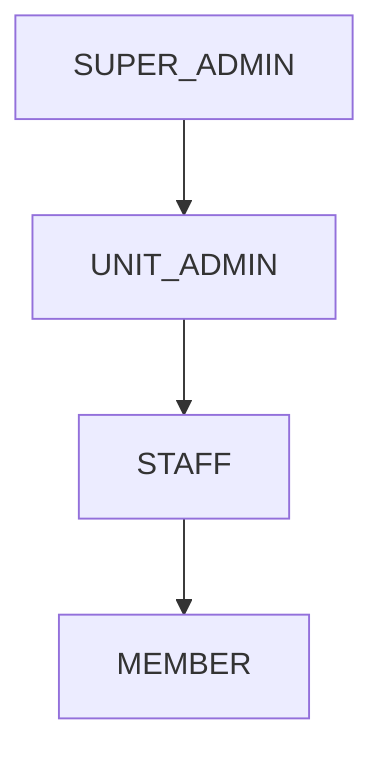

# API Reference

<!-- Copyright 2026 Chronos Ledger Contributors (Apache 2.0) -->

**Machine-readable contract**: [`docs/openapi.yaml`](openapi.yaml): OpenAPI 3.1.

**Interactive UI** (live server): `http://<server>/docs` (Swagger UI) · `http://<server>/redoc` (ReDoc)

Base URL: `http://<server>/api/v1`

---

## Authentication

All endpoints except `/auth/login`, `/guest/register-checkin`, and `/guest/directory`
require a Bearer token:

```
Authorization: Bearer <access_token>
```

Tokens expire after `JWT_ACCESS_TOKEN_EXPIRE_MINUTES` (default: 480 min / 8 hours).

### Role hierarchy



Higher roles inherit the permissions of all roles below them. Role is embedded in the JWT payload and validated server-side on every request.

---

### POST /auth/login

```json
// Request
{ "email": "user@org.internal", "password": "…" }

// Response 200
{
  "access_token": "<jwt>",
  "token_type": "bearer",
  "user_id": "FAC001",
  "role": "STAFF",
  "full_name": "Dr. Priya Sharma",
  "initial_login_state": false
}
```

`initial_login_state: true` on first login, the client should redirect to the change-password flow.

### POST /auth/change-password

```json
{ "current_password": "…", "new_password": "…" }
```

### GET /auth/me

Returns the current user's `UserResponse` (see Users section).

---

## Users

### GET /users/ `[ADMIN]`
### POST /users/ `[SUPER_ADMIN]`

Create users individually. For bulk creation, use CSV import (`POST /ingestion/upload-csv`).

```json
// POST body
{
  "id": "FAC042",
  "full_name": "Dr. Rajan Mehta",
  "email_address": "rajan@org.internal",
  "password": "InitialPass1!",
  "role_type": "STAFF",
  "unit_code": "CSE",
  "assigned_base_station": "Staff Room Block A",
  "reporting_line_manager": "HOD001"
}
```

### GET /users/staff/available `[public]`

Returns staff with `OPEN_AD_HOC` or `VERY_FREE` status. Used by the Guest Kiosk.

### GET /users/{user_id}
### PUT /users/{user_id}
### DELETE /users/{user_id} `[SUPER_ADMIN]`
### PATCH /users/{user_id}/status

Update staff occupancy. Enum values: `OPEN_AD_HOC`, `BUSY`, `CRITICAL_DO_NOT_DISTURB`, `VERY_FREE`.

```json
{ "status": "BUSY" }
```

---

## Schedule

### GET /schedule/ledger/today

Returns today's `DailyLedger` entries scoped to the caller's role:
- **Staff** → sessions where they are active or substitute lead
- **Member** → sessions for their registered activities
- **Admin** → all sessions

### GET /schedule/ledger/{ledger_id}
### PATCH /schedule/ledger/{ledger_id} `[STAFF, ADMIN]`

```json
// Patch to switch to online delivery
{
  "delivery_format": "ONLINE_STREAM",
  "virtual_connection_string": "https://meet.google.com/xyz-abc-def"
}
```

```json
// Patch geofence for ad-hoc room change
{
  "latitude_target": 12.971598,
  "longitude_target": 77.594562,
  "altitude_target": 920.5,
  "precision_radius_meters": 15
}
```

### GET /schedule/staff/{staff_id}/location

4-tier location resolver result. See [`docs/flows.md`](flows.md) for resolution order.

```json
{
  "resolved_location": "Room 204: Active Class",
  "status": "SCHEDULED",
  "staff_id": "FAC001",
  "full_name": "Dr. Priya Sharma",
  "occupancy_index": "BUSY"
}
```

### GET /schedule/staff/all/locations

Snapshot of all staff locations. Polled by the Member Locator panel.

### GET /schedule/cycles
### POST /schedule/cycles `[ADMIN]`
### PATCH /schedule/cycles/{id}/close `[ADMIN]`
### POST /schedule/cycles/{old}/clone-to/{new} `[ADMIN]`

---

## Attendance

### POST /attendance/mark

```json
{
  "ledger_instance_id": 1042,
  "member_id": "STU20210001",
  "marking_status": "PRESENT",
  "user_lat": 12.971598,
  "user_lon": 77.594562,
  "user_alt": 920.5
}
```

Omit `user_lat`/`user_lon`/`user_alt` to skip geofence validation (e.g., GPS unavailable).
Members may only mark themselves; staff/admins can mark any member.

### POST /attendance/batch `[STAFF, ADMIN]`

```json
{
  "ledger_instance_id": 1042,
  "records": [
    { "ledger_instance_id": 1042, "member_id": "STU001", "marking_status": "PRESENT" },
    { "ledger_instance_id": 1042, "member_id": "STU002", "marking_status": "LATE" }
  ]
}
```

### GET /attendance/ledger/{ledger_id}

All attendance records for a session.

### POST /attendance/absence `[STAFF]`

Submit a Reverse RSVP (absence request):

```json
{ "target_absence_date": "2026-06-15", "context_justification": "National seminar." }
```

Routes to `reporting_line_manager` for approval. On approval, the corresponding `DailyLedger` entry flips to `ON_LEAVE`. See [`docs/flows.md`](flows.md) for the full state machine.

### GET /attendance/absence/pending `[MANAGER, ADMIN]`

Returns absence requests pending your approval.

### PATCH /attendance/absence/{id}/decide `[MANAGER, ADMIN]`

```json
{ "decision": "VERIFIED_APPROVED" }
// or
{ "decision": "VERIFIED_DENIED" }
```

### POST /attendance/annotations `[STAFF, ADMIN]`
### GET /attendance/annotations/{ledger_id}

Attach freeform notes to a session (lab issues, late starts, etc.).

```json
{ "ledger_instance_id": 1042, "classification_tag": "LATE_START", "annotation_payload": "Lab setup delayed." }
```

---

## Guest Gate

### POST /guest/register-checkin `[no auth]`

Public kiosk endpoint. Fires a real-time WebSocket notification to the target staff.

```json
{
  "guest_name": "John Smith",
  "contact_phone": "+91 98765 43210",
  "originating_body": "TechCorp Ltd",
  "target_staff_id": "FAC001",
  "visitation_intent": "Research collaboration discussion"
}
```

### GET /guest/directory `[no auth]`

`?name=<string>`, case-insensitive name search. Returns staff with `OPEN_AD_HOC` or `VERY_FREE` status.

### GET /guest/ `[STAFF]`

Pending guest requests targeting the authenticated staff member.

### PATCH /guest/{id}/decide `[STAFF]`

```json
{ "decision": "VERIFIED_APPROVED" }
```

---

## Ingestion

### POST /ingestion/upload-csv?cycle_id={id} `[ADMIN]`

Upload a `multipart/form-data` CSV file. Required columns:

| Column | Example |
|---|---|
| `member_id` | STU20210001 |
| `member_name` | Alice Kumar |
| `member_email` | alice@org.internal |
| `activity_code` | CS301 |
| `activity_title` | Operating Systems |
| `unit` | CSE |
| `day_of_week_index` | 1 (Monday) … 7 (Sunday) |
| `time_window_start` | 09:00 |
| `time_window_end` | 10:00 |
| `lead_id` | FAC001 |
| `room` | Room 204 |

Import is idempotent, re-uploading the same file is safe.

### POST /ingestion/generate-ledger `[ADMIN]`

```json
{ "target_date": "2026-09-01" }   // optional; defaults to tomorrow
```

---

## Calendar Sync

### GET /sync/user-feed/{user_id}.ics

Live iCalendar feed (rolling 37-day window). Subscribe directly in any calendar app:

```
webcal://<server>/api/v1/sync/user-feed/FAC001.ics
```

Staff feed includes sessions where they are active or substitute lead.
Member feed includes all registered activities.

---

## WebSocket

```
ws://<server>/ws?token=<jwt>
```

Persistent receive-only connection. Events delivered as JSON frames:

| Event | Who receives | Payload |
|---|---|---|
| `ABSENCE_APPROVAL_REQUIRED` | Line manager | `{log_id, from, date}` |
| `ABSENCE_DECISION` | Staff who submitted | `{log_id, decision}` |
| `GUEST_HANDSHAKE_REQ` | Target staff | `{transaction_id, guest_name, originating_body, intent}` |
| `LEDGER_STATE_CHANGE` | All connected users | `{ledger_id, new_state}` |

The client sends no upstream frames, the connection is subscribe-only.
