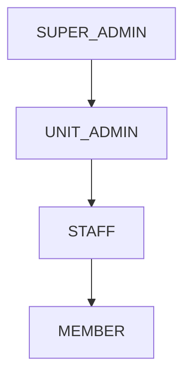

# API Reference

<!-- Copyright 2026 Chronos Ledger Contributors (Apache 2.0) -->

**Machine-readable contract**: [`docs/openapi.yaml`](openapi.yaml): OpenAPI 3.1.

**Interactive UI** (live server): `http://<server>/docs` (Swagger UI) · `http://<server>/redoc` (ReDoc)

Base URL: `http://<server>/api/v1`

---

## Authentication

All endpoints except `/auth/login`, `/guest/register-checkin`, and `/guest/directory`
require a Bearer token:

```
Authorization: Bearer <access_token>
```

Tokens expire after `JWT_ACCESS_TOKEN_EXPIRE_MINUTES` (default: 480 min / 8 hours).

An API key in `X-API-Key` is accepted anywhere a Bearer token is. See
[API keys](#api-keys).

### Role hierarchy



Higher roles inherit the permissions of all roles below them. Role is embedded in the JWT payload and validated server-side on every request.

---

### POST /auth/login

```json
// Request
{ "email": "user@org.internal", "password": "…" }

// Response 200
{
  "access_token": "<jwt>",
  "token_type": "bearer",
  "user_id": "FAC001",
  "role": "STAFF",
  "full_name": "Dr. Priya Sharma",
  "initial_login_state": false
}
```

`initial_login_state: true` on first login, the client should redirect to the change-password flow.

### POST /auth/change-password

```json
{ "current_password": "…", "new_password": "…" }
```

### GET /auth/me

Returns the current user's `UserResponse` (see Users section).

---

## API keys

A key authenticates a machine the way a token authenticates a person. Send it
in `X-API-Key` and it works on every endpoint a token works on. It acts as the
user it is bound to, so bind one to a service account and not to a person: a
key bound to an admin can do everything that admin can.

Unlike a token, a key can be narrowed to part of the API and can be made to
run out.

### Scopes

A scope is `<area>:read` or `<area>:write`. The area is the path segment after
`/api/v1`, and `GET`, `HEAD` and `OPTIONS` are reads while everything else is
a write. The scope a request needs is therefore read off the request, which
means no endpoint has to opt in to being covered and a new endpoint cannot
land open by nobody remembering to annotate it.

| Area | Covers |
|---|---|
| `config` | `/config` |
| `auth` | login, password change, `/auth/me` |
| `api-keys` | issuing, listing and revoking keys |
| `users` | the user directory |
| `resources` | rooms and their availability |
| `schedule` | slots, the daily ledger, cycles, staff locations |
| `attendance` | marking, absence requests, annotations |
| `guest` | the kiosk endpoints |
| `ingestion` | CSV upload and ledger generation |
| `sync` | the calendar feed |

A key holding `schedule:read` passes `GET /schedule/slots` and is refused
`POST /schedule/slots` with `403` and a detail naming `schedule:write`. The
same key is refused `GET /users/` naming `users:read`: holding one area says
nothing about another.

The single scope `*` is every area. That is what a key created without naming
any scopes gets, and what every key issued before scopes existed was
backfilled to, so nothing that worked before stopped working. `GET /api-keys/`
shows the scopes of each key, which is how you find the unrestricted ones.

### Expiry

`expires_at` is checked on the request rather than by a sweep, so a key stops
working the moment it runs out, answering `401` with `API key expired`. Omit
the field for a key that never runs out. A time already in the past is refused
at creation: a key that is dead on arrival is a mistake, not a request.

### POST /api-keys/ `[SUPER_ADMIN]`

```json
{
  "label": "PulseWard HMS",
  "user_id": "SVC001",
  "scopes": ["schedule:read", "resources:read"],
  "expires_at": "2027-01-01T00:00:00Z"
}
```

`scopes` and `expires_at` are both optional. Omitting `scopes` gives `*`; an
empty array is refused, since a key that can reach nothing is not a key
anybody wants.

```json
{
  "id": 3,
  "key_prefix": "ck_8Kd2mQ7x",
  "label": "PulseWard HMS",
  "user_id": "SVC001",
  "scopes": "resources:read,schedule:read",
  "expires_at": "2027-01-01T00:00:00Z",
  "created_at": "2026-09-09T10:14:00Z",
  "api_key": "ck_8Kd2mQ7xR3nL9vB5tY1wZ0aC6eF4gH2jK8mN"
}
```

`api_key` appears here and nowhere else. Only its hash is stored, so a lost
key is revoked and reissued, never recovered. Scopes come back sorted and
deduplicated.

### GET /api-keys/ `[SUPER_ADMIN]`

Every key, without its secret.

### DELETE /api-keys/{key_id} `[SUPER_ADMIN]`

Revokes immediately: the next request using it gets `401`.

---

## Users

### GET /users/ `[ADMIN]`
### POST /users/ `[SUPER_ADMIN]`

Create users individually. For bulk creation, use CSV import (`POST /ingestion/upload-csv`).

```json
// POST body
{
  "id": "FAC042",
  "full_name": "Dr. Rajan Mehta",
  "email_address": "rajan@org.internal",
  "password": "InitialPass1!",
  "role_type": "STAFF",
  "unit_code": "CSE",
  "assigned_base_station": "Staff Room Block A",
  "reporting_line_manager": "HOD001"
}
```

### GET /users/staff/available `[public]`

Returns staff with `OPEN_AD_HOC` or `VERY_FREE` status. Used by the Guest Kiosk.

### GET /users/{user_id}
### PATCH /users/{user_id} `[ADMIN]`

### POST /users/{user_id}/reset-password `[ADMIN]`

Issues a new random password for someone who cannot sign in, and returns it
once:

```json
{ "user_id": "STU042", "initial_password": "kQ7mZ2pV1xNc" }
```

This is the only way back into a locked-out account: `POST
/auth/change-password` needs the password the user has lost, and there is no
mail sender configured to put a reset link through. Copy the value before
closing the response. It is not stored, and calling the endpoint again issues
a different one.

A reset drops every refresh token the user holds and rotates their calendar
feed URL, so it doubles as the response to a compromised account. A
`UNIT_ADMIN` may only reset users inside their own unit, and may not reset an
admin account.

### PUT /users/{user_id}/status

Update staff occupancy. Enum values: `OPEN_AD_HOC`, `BUSY`, `CRITICAL_DO_NOT_DISTURB`, `VERY_FREE`.

```json
{ "status": "BUSY" }
```

---

## Resources

A resource is a thing the schedule can point at: a room, a person, a piece of
equipment. Rooms arrive from a CSV import knowing only their name, so capacity
and coordinates are filled in here.

### GET /resources/

Optional filters: `resource_type` (`ROOM` or `PERSON`), `active`, `code`.
Readable by anyone signed in.

```json
[
  {
    "id": 12,
    "code": "LH-3",
    "label": "Lecture Hall 3",
    "resource_type": "ROOM",
    "unit_code": null,
    "capacity": 90,
    "user_id": null,
    "latitude": 12.9716,
    "longitude": 77.5946,
    "altitude_target": 920.0,
    "active": true
  }
]
```

### GET /resources/{id}/availability?from={date}&to={date}

When the resource is already taken, between two dates inclusive. Both
parameters are required.

```json
{
  "resource_id": 12,
  "code": "LH-3",
  "from": "2026-01-05",
  "to": "2026-01-11",
  "busy": [
    {
      "date": "2026-01-05",
      "start": "09:00:00",
      "end_date": "2026-01-05",
      "end": "10:00:00",
      "activity_id": 4,
      "activity_code": "CS101",
      "master_slot_id": 7,
      "reservation_id": null
    },
    {
      "date": "2026-01-05",
      "start": "22:00:00",
      "end_date": "2026-01-06",
      "end": "06:00:00",
      "activity_id": null,
      "activity_code": null,
      "master_slot_id": null,
      "reservation_id": 31
    }
  ]
}
```

Busy intervals, not free ones. Free time is the complement against whatever
hours the caller considers open, and only the caller knows those.

Times are naive wall clock in the organisation's own timezone, the same as the
slot stores. They carry no offset and no `Z`.

What counts as taken: a weekly slot pointing at this resource whose cycle is
flagged open, and any reservation on it that has not been cancelled. Cycle
date bounds are **not** consulted, because nightly ledger generation does not
consult them either. Answering otherwise would report a room free on a date
the generator is going to fill.

Which kind an interval is can be read off the fields that are filled in. A
slot carries `activity_id`, `activity_code` and `master_slot_id` with a null
`reservation_id`; a reservation carries the reverse. What a booking is for is
deliberately not here: this route is readable by anyone signed in, and the
purpose is returned only to the caller that made the booking.

An interval carries `end_date` as well as `date`, and the two differ when the
window ran past midnight. `date` is the day it opened on, which for an
overnight interval is the day before the one it occupies, so an interval's
`date` can be earlier than `from`: a booking dated Monday from `22:00` to
`06:00` is on Tuesday's calendar and comes back when you ask about Tuesday.
Read each interval by its own `date` and `end_date` and not by the range that
returned it. Grouping by `date` alone files that hold under a day nobody asked
about, and discarding anything outside the range shows a ward as free while it
is staffed.

Two things this does not see. A day-level change made through
`PATCH /schedule/ledger/{id}` lives on the day, not on the slot, so it is not
reflected. And an inactive resource still answers: retiring a room does not
clear its calendar.

`from` after `to` is `422` (`from must not be after to`). A range longer than
366 days inclusive is `422` (`the range must not exceed 366 days`), which
leaves room for the next twelve months from any date, leap years included.

### PATCH /resources/{id} `[SUPER_ADMIN]`

```json
{
  "label": "Lecture Hall 3",
  "capacity": 90,
  "latitude": 12.9716,
  "longitude": 77.5946,
  "altitude_target": 920.0,
  "active": true
}
```

Every field is optional, and a field left out is left alone. `latitude` and
`longitude` are set or cleared together: sending one without the other is
`422`, since half a location fences the room to a point on the equator.
Setting them is what switches geofencing on for every session held there, so
until a room is placed, its sessions are not fenced at all.

`code`, `resource_type` and `user_id` cannot be changed here. `code` is the
importer's match key, so renaming it would make the next upload create a
second row rather than find this one; change `label` instead, which is what
gets shown. A room that becomes a person is not an edit, it is a different
resource.

### POST /resources/{id}/reservations `[SUPER_ADMIN, UNIT_ADMIN]`

Hold a resource for one dated window. This is the route an outside system uses
to take a room: a hospital system books a consulting room here the same way an
admin would.

An `Idempotency-Key` header is required, 8 to 120 characters, and a UUID is
the right shape. It is required rather than optional because a booking client
talking over a network retries, and a retry that books a second room is worse
than one that fails outright.

```json
// POST /api/v1/resources/12/reservations
// Idempotency-Key: 6f1c2e40-2c5f-4d0e-9a5b-1c7c0f9c3a11
{
  "date": "2026-01-06",
  "start": "14:00",
  "end": "15:00",
  "purpose": "Ward round"
}
```

`201` with the hold:

```json
{
  "id": 31,
  "resource_id": 12,
  "resource_code": "LH-3",
  "date": "2026-01-06",
  "start": "14:00:00",
  "end": "15:00:00",
  "purpose": "Ward round",
  "status": "HELD",
  "requested_by_id": "ADM001",
  "idempotency_key": "6f1c2e40-2c5f-4d0e-9a5b-1c7c0f9c3a11",
  "created_at": "2026-01-05T09:14:22Z",
  "cancelled_at": null
}
```

The same key sent again with the same body returns `200` and the original row,
cancelled or not: a retry is asking what happened, not asking for a second
room. The same key with a different body is `422` (`that Idempotency-Key was
used for a different request`). The resource is part of what the key is
checked against, so pointing one key at two different rooms is that same
`422` rather than a quiet double booking.

`409` when something already has part of the window, and the body says what it
ran into:

```json
{
  "detail": {
    "message": "the resource is already taken for part of that window",
    "conflicts": [
      {
        "date": "2026-01-06",
        "start": "14:30:00",
        "end_date": "2026-01-06",
        "end": "15:30:00",
        "activity_id": null,
        "activity_code": null,
        "master_slot_id": null,
        "reservation_id": 28
      }
    ]
  }
}
```

Windows are half open, so an interval ending at ten and one starting at ten do
not clash. Back to back bookings are the normal case and refusing them would
make a room unusable in any schedule that runs on the hour.

An `end` earlier than the `start` means the window runs past midnight and
finishes on the day after `date`: `22:00` to `06:00` is a night shift of eight
hours, not a negative sixteen. No field says which day the end falls on, only
that rule. `end` equal to `start` is `422`, because `09:00` to `09:00` is
either nothing at all or a full day and there is no way to tell which was
meant.

A weekly slot reads its two times by the same rule, so a night shift can be a
recurring slot and not only a one off hold, and an overnight booking is
checked against night shifts on the timetable as well as against day ones.

What this refuses is exactly what `GET availability` calls busy: the same two
queries, through the same expansion. The rule runs both ways. A class cannot
be put on top of a hold either, so `POST /schedule/slots`, `PATCH
/schedule/slots/{id}` and a CSV upload are each refused where a booking
already stands. A hold taken here holds against the timetable and not only
against other holds.

Two callers racing for the same window are serialised by a row lock on the
resource, two copies of one request collide on the unique key index, and
underneath both sits an exclusion constraint over the window itself, added
by migration 010. The second row is refused whatever order the two callers
arrive in. When the constraint is what catches it, the window is looked up
again and the `409` names the hold that won rather than only saying this
one lost.

### DELETE /resources/{id}/reservations/{reservation_id} `[SUPER_ADMIN, UNIT_ADMIN]`

Let a hold go. Returns the reservation with `status` set to `CANCELLED` and
`cancelled_at` filled in. The row stays: a deleted row cannot be told to
anybody, and a system that was informed the room was held has to be able to
learn that it no longer is.

The freed window is bookable again immediately and stops appearing in
availability. Cancelling twice is not an error and returns the same timestamp,
because the caller wanted the room free and the room is free. Cancelling
through the wrong resource id is `404`.

A hold is let go by whoever took it. A `UNIT_ADMIN` that did not make a
reservation gets `403` with `"only the caller that took a hold may cancel it"`,
which matters because more than one integration books through this route with
the same role, and one dropping another's hold is how a room goes quietly free
under a system that still believes it has it. A `SUPER_ADMIN` overrides: a hold
taken by an account that has since been deleted has a null `requested_by_id`
and nobody left to cancel it.

---

## Schedule

### GET /schedule/ledger/today

Returns today's `DailyLedger` entries scoped to the caller's role:
- **Staff** → sessions where they are active or substitute lead
- **Member** → sessions for their registered activities
- **Admin** → all sessions

### GET /schedule/ledger/{ledger_id}
### PATCH /schedule/ledger/{ledger_id} `[STAFF, ADMIN]`

```json
// Patch to switch to online delivery
{
  "delivery_format": "ONLINE_STREAM",
  "virtual_connection_string": "https://meet.google.com/xyz-abc-def"
}
```

```json
// Patch geofence for ad-hoc room change
{
  "latitude_target": 12.971598,
  "longitude_target": 77.594562,
  "altitude_target": 920.5,
  "precision_radius_meters": 15
}
```

### GET /schedule/staff/{staff_id}/location

4-tier location resolver result. See [`docs/flows.md`](flows.md) for resolution order.

```json
{
  "resolved_location": "Room 204: Active Class",
  "status": "SCHEDULED",
  "staff_id": "FAC001",
  "full_name": "Dr. Priya Sharma",
  "occupancy_index": "BUSY"
}
```

### GET /schedule/staff/all/locations

Snapshot of all staff locations. Polled by the Member Locator panel.

### GET /schedule/cycles
### POST /schedule/cycles `[ADMIN]`
### PATCH /schedule/cycles/{id}/close `[ADMIN]`
### POST /schedule/cycles/{old}/clone-to/{new} `[ADMIN]`

### POST /schedule/slots `[ADMIN]`
### PATCH /schedule/slots/{id} `[ADMIN]`

Create a weekly slot, or move an existing one. Both are refused with `409`
where the room is already taken for part of that window, either by a booking
or by another class already on the timetable:

```json
{
  "detail": {
    "message": "the resource is held for part of that window",
    "conflicts": [
      {
        "date": "2026-03-04",
        "start": "09:00:00",
        "end_date": "2026-03-04",
        "end": "10:00:00",
        "activity_id": null,
        "activity_code": null,
        "master_slot_id": null,
        "reservation_id": 41
      }
    ]
  }
}
```

The same body `POST /resources/{id}/reservations` sends when it refuses, so a
clash reads the same way whichever end it came from. Two limits on what
counts: only holds from today forward, because a slot lays down days from now
onwards and never backwards, and nothing at all if the slot belongs to a
closed cycle, because such a slot does not occupy the room and a booking is
already accepted on top of one.

A class already on the timetable is refused the same way, with a different
message and the same shape:

```json
{
  "detail": {
    "message": "the resource is already on the timetable for part of that window",
    "conflicts": [
      {
        "date": "2026-03-04",
        "start": "09:00:00",
        "end_date": "2026-03-04",
        "end": "10:00:00",
        "activity_id": 12,
        "activity_code": "CS101",
        "master_slot_id": 88,
        "reservation_id": null
      }
    ]
  }
}
```

Which kind of thing an entry is can be read off the fields that are set: a
class names the activity and leaves `reservation_id` null, a booking does the
reverse. That is the same convention `GET /resources/{id}/availability` uses.

A weekly slot has no date of its own, so the one reported is the next time
the clash actually happens. It repeats every week until one of the two moves.

Every open cycle counts, including a second one covering a different part of
the year. The nightly generator lays every open cycle onto today whatever the
cycles say their date bounds are, so all of them hold the room today, and a
free-looking hour that the generator is going to fill would be worse than a
refusal.

A `PATCH` is only checked when it would actually move the class. Changing the
lead on a slot, or anything else that leaves the room, weekday and window
alone, is allowed even where a hold or another class is sitting on that slot
already: such an overlap predates this rule or was written straight into the
database, and refusing would leave the lead unfixable short of cancelling
somebody else's booking. A slot is never counted against itself either, so
widening a window from 09:00 to 11:00 is not refused by the 09:00 to 10:00 it
replaces.

A refused `PATCH` changes nothing. The room is resolved and the clashes are
checked before any day the slot has already produced is withdrawn.

---

## Attendance

### POST /attendance/mark

```json
{
  "ledger_instance_id": 1042,
  "member_id": "STU20210001",
  "marking_status": "PRESENT",
  "user_lat": 12.971598,
  "user_lon": 77.594562,
  "user_alt": 920.5
}
```

Omit `user_lat`/`user_lon`/`user_alt` to skip geofence validation (e.g., GPS unavailable).
Members may only mark themselves; staff/admins can mark any member.

### POST /attendance/batch `[STAFF, ADMIN]`

```json
{
  "ledger_instance_id": 1042,
  "records": [
    { "ledger_instance_id": 1042, "member_id": "STU001", "marking_status": "PRESENT" },
    { "ledger_instance_id": 1042, "member_id": "STU002", "marking_status": "LATE" }
  ]
}
```

### GET /attendance/ledger/{ledger_id}

All attendance records for a session.

### POST /attendance/absence `[STAFF]`

Submit a Reverse RSVP (absence request):

```json
{ "target_absence_date": "2026-06-15", "context_justification": "National seminar." }
```

Routes to `reporting_line_manager` for approval. On approval, the corresponding `DailyLedger` entry flips to `ON_LEAVE`. See [`docs/flows.md`](flows.md) for the full state machine.

### GET /attendance/absence/pending `[MANAGER, ADMIN]`

Returns absence requests pending your approval.

### PATCH /attendance/absence/{id}/decide `[MANAGER, ADMIN]`

```json
{ "decision": "VERIFIED_APPROVED" }
// or
{ "decision": "VERIFIED_DENIED" }
```

### POST /attendance/annotations `[STAFF, ADMIN]`
### GET /attendance/annotations/{ledger_id}

Attach freeform notes to a session (lab issues, late starts, etc.).

```json
{ "ledger_instance_id": 1042, "classification_tag": "LATE_START", "annotation_payload": "Lab setup delayed." }
```

---

## Guest Gate

### POST /guest/register-checkin `[KIOSK KEY]`

The kiosk endpoint. The visitor does not log in; the kiosk device sends an
admin-issued API key in `X-API-Key`. Fires a real-time WebSocket notification
to the target staff. Every field is length-bounded, and `contact_phone` accepts
only digits, spaces and `+ ( ) -`.

A lobby terminal is the clearest case for a narrow key: `["guest:read",
"guest:write"]` lets it check people in and read the directory and nothing
else, which matters for a device sitting in a public space. See
[Scopes](#scopes).

```json
{
  "guest_name": "John Smith",
  "contact_phone": "+91 98765 43210",
  "originating_body": "TechCorp Ltd",
  "target_staff_id": "FAC001",
  "visitation_intent": "Research collaboration discussion"
}
```

### GET /guest/directory `[KIOSK KEY]`

`?name=<string>`, case-insensitive name search, minimum two characters so the
roster cannot be walked one letter at a time. Returns staff with `OPEN_AD_HOC`
or `VERY_FREE` status.

### GET /guest/ `[STAFF]`

Pending guest requests targeting the authenticated staff member.

### PATCH /guest/{id}/decide `[STAFF]`

```json
{ "decision": "VERIFIED_APPROVED" }
```

---

## Ingestion

### POST /ingestion/upload-csv?cycle_id={id} `[SUPER_ADMIN]`

Upload a `multipart/form-data` CSV file. Required columns:

| Column | Example |
|---|---|
| `member_id` | STU20210001 |
| `member_name` | Alice Kumar |
| `member_email` | alice@org.internal |
| `activity_code` | CS301 |
| `activity_title` | Operating Systems |
| `unit` | CSE |
| `day_of_week_index` | 1 (Monday) … 7 (Sunday) |
| `time_window_start` | 09:00 |
| `time_window_end` | 10:00 |
| `lead_id` | FAC001 |
| `room` | Room 204 |

Import is idempotent, and a re-upload is how a timetable is corrected in
bulk. A slot matching an existing one on activity, weekday and start time
has its end time, lead and room brought into line, and the days already
generated from it follow. The exception is a day somebody has already
marked or annotated: those are counted in `ledger_rows_kept` and left
disagreeing with the timetable on purpose, because they record what
happened rather than what was planned. A member who already exists keeps
their password, and somebody promoted to STAFF since the last import stays
STAFF.

A row that would put a class in a room already taken for that window, by a
booking or by another class, is refused with `422`, and the whole file is
rolled back rather than the row skipped, which is what every other bad row in
an import does. The message names the room and what it ran into. Rows are
checked against each other as well, so one file cannot put two classes in one
room at one hour. The check only looks where a row would actually move a
class, so re-uploading a file that describes the timetable as it already
stands is not refused by what is sitting on it.

Every member the file creates gets an individual random password, returned
once in the response and never stored:

```json
{
  "status": "SUCCESS",
  "rows_ingested": 412,
  "provisioned_credentials": [
    { "member_id": "STU20210001", "email_address": "alice@org.internal", "initial_password": "kQ7mZ2pV1xNc" }
  ]
}
```

Save that list. The server keeps only the bcrypt hash, so a lost password
has to be reissued one member at a time through
`POST /users/{user_id}/reset-password`.

**An import never removes anything.** A file covering one unit cannot be
told apart from a timetable that lost every other unit, so slots and
enrollments the cycle holds that the file does not mention come back in
`not_in_file` for somebody to decide about:

```json
{
  "status": "SUCCESS",
  "rows_ingested": 412,
  "slots_corrected": 2,
  "ledger_rows_updated": 5,
  "ledger_rows_kept": 1,
  "not_in_file": {
    "slots": [
      { "id": 87, "activity_code": "PH101", "day_of_week_index": 3, "time_window_start": "11:00:00", "room": "LH-305" }
    ],
    "enrollments": [
      { "member_id": "STU20210044", "activity_code": "PH101" }
    ]
  }
}
```

The report is scoped to the units named in the file, so a CSE upload does
not list every ECE class every time. Act on a reported slot with
`DELETE /schedule/slots/{id}`, which keeps the days already past.

A class whose start time moved shows up here too. The slot match is on
activity, weekday and start time, so a class moved from 09:00 to 14:00 does
not match: it arrives as a second slot and the 09:00 one is reported rather
than guessed at. No column in the file can say "this is the 09:00 class,
moved", and guessing wrong would delete somebody's timetable.

**Practical size limit.** Each new member costs one bcrypt hash on the
request thread, roughly half a second, and the work happens before the
response is sent. The browser client waits 60 seconds and nginx
(`proxy_read_timeout` in `nginx/chronos-common.conf`) also waits 60, which
puts the ceiling near 100 *new* members per file. Rows for members who
already exist are cheap and do not count against it. Split a larger roll
into several files.

A timed-out upload is the awkward case: the server finishes and commits
regardless, so the accounts exist but nobody ever saw their passwords.
Reset those members individually, or re-upload after raising both
timeouts.

### POST /ingestion/generate-ledger `[ADMIN]`

```json
{ "target_date": "2026-09-01" }   // optional; defaults to tomorrow
```

---

## Calendar Sync

### GET /sync/user-feed/{user_id}.ics

Live iCalendar feed (rolling 37-day window). Subscribe directly in any calendar app:

```
webcal://<server>/api/v1/sync/user-feed/FAC001.ics
```

Staff feed includes sessions where they are active or substitute lead.
Member feed includes all registered activities.

---

## WebSocket

```
ws://<server>/ws?token=<jwt>
```

Persistent receive-only connection. Events delivered as JSON frames:

| Event | Who receives | Payload |
|---|---|---|
| `ABSENCE_APPROVAL_REQUIRED` | Line manager | `{log_id, from, date}` |
| `ABSENCE_DECISION` | Staff who submitted | `{log_id, decision}` |
| `GUEST_HANDSHAKE_REQ` | Target staff | `{transaction_id, guest_name, originating_body, intent}` |
| `LEDGER_STATE_CHANGE` | All connected users | `{ledger_id, new_state}` |

The client sends no upstream frames, the connection is subscribe-only.
