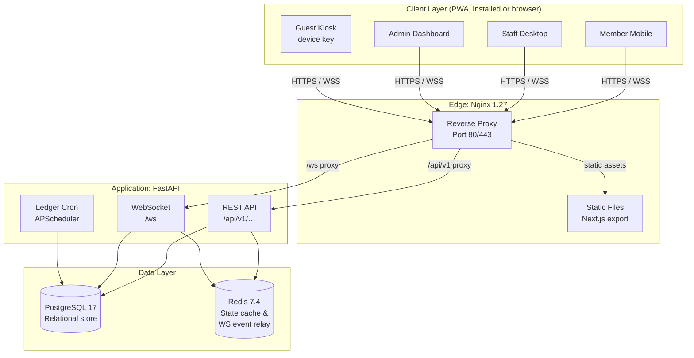
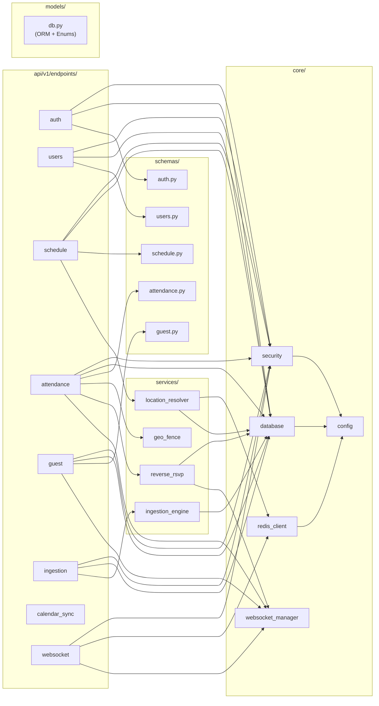
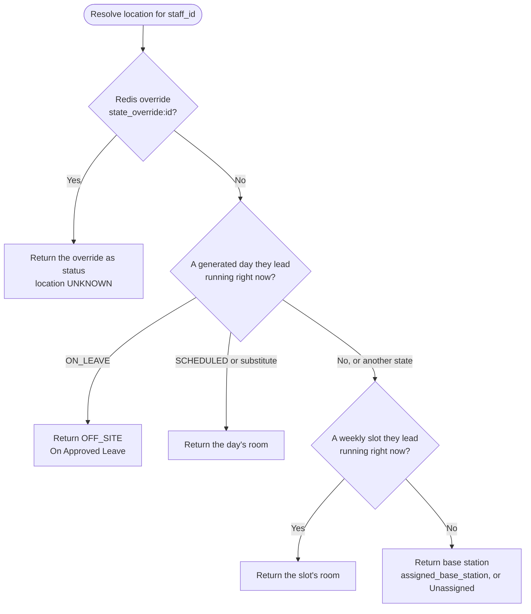
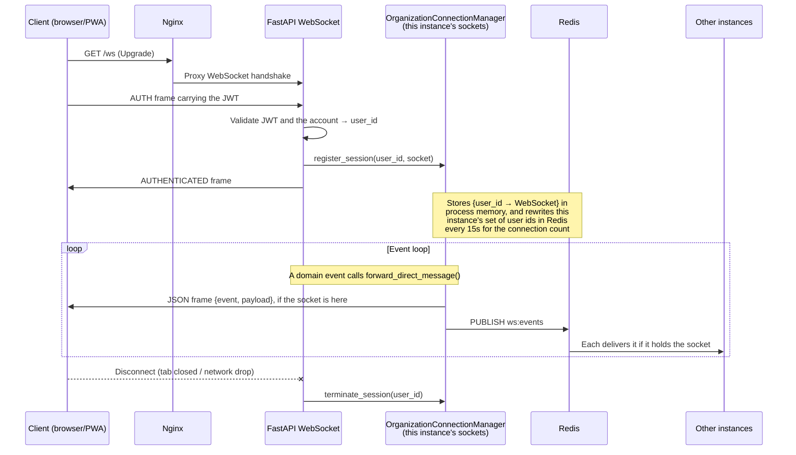
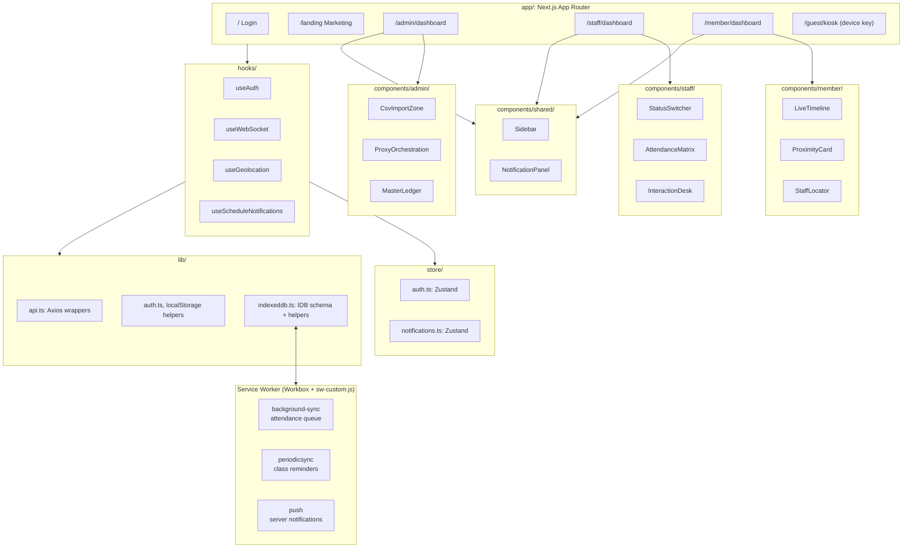

# Architecture

<!-- Copyright 2026 Chronos Ledger Contributors (Apache 2.0) -->

## System Topology

**What each box does**

| Component | Role |
|---|---|
| **Nginx** | TLS termination, gzip, security headers, static file serving, proxy to FastAPI. Serves pre-built Next.js export from the shared `frontend_build` Docker volume. |
| **FastAPI app** | All REST endpoints + WebSocket hub. One uvicorn process per container with no state of its own beyond PostgreSQL and Redis, so several can run behind a load balancer; see [Scaling](deployment.md#scaling). |
| **APScheduler** | Runs `ledger_generator` at 23:00 in `ORG_TIMEZONE` to materialize `DailyLedger` rows from `StructuralMasterSlot` for the next day, and once at startup for any day a stopped process missed. Also deletes expired refresh tokens at 03:00 and, when `GUEST_RETENTION_DAYS` is set, old visitor check-ins at 03:30. |
| **PostgreSQL** | Source of truth for all persistent data: users, schedule, attendance, absence logs, guest transactions. |
| **Redis** | Short-lived state: the rate-limit counters, the per-person status override the location resolver checks first, the channel instances relay WebSocket events and closes over, and each instance's set of connected users (TTL) for the connection count. |

---

## Backend Module Dependency Graph

**Why this layout matters:** Each endpoint module imports from `core/` (infra) and `services/` (domain logic) but never imports another endpoint module. Services are pure domain logic with no HTTP concerns. This makes unit-testing services straightforward without mocking HTTP.

---

## 4-Tier Staff Location Resolution

**Each tier explained:**

1. **Redis override**: If Redis holds `state_override:<staff_id>`, its value is returned as the status and the location as `UNKNOWN`, since an override says what somebody is doing rather than where. No route in Chronos writes this key. `PUT /users/{user_id}/status` sets the account's `current_occupancy_index` instead, which the location routes report as `occupancy_index` next to whatever the tiers resolve.
2. **Generated day**: The `DailyLedger` rows the person leads today, and yesterday's for a shift that runs past midnight, each compared on its own window. A row running now answers: `ON_LEAVE`, which is what an approved absence sets, gives `OFF_SITE`, and `SCHEDULED` or `PROXY_SUBSTITUTE` gives the row's room. A row in any other state, a lunch or a meeting, falls through to the timetable.
3. **Master timetable**: The weekly `StructuralMasterSlot` rows the person leads. A slot running now gives its room. This is what answers on a day the nightly job has not written yet.
4. **Base station fallback**: The `assigned_base_station` field on the `User` record (e.g., "Front Desk") is the last-resort answer. The column has no default, so a user with none recorded resolves to `Unassigned` rather than to a named place.

---

## WebSocket Session Lifecycle

**Why WebSockets instead of polling:** Absence approvals and guest handshakes need sub-second delivery to the staff dashboard. Polling at any sane interval (≥5s) introduces noticeable lag in the two-party guest interaction flow. Each instance keeps the sockets it holds in process memory and relays events to the other instances through Redis, so a client connects to whichever instance the load balancer picks and needs no code of its own for it.

---

## Frontend Architecture

**Key design choices:**

- **Static export** (`output: 'export'`): The entire frontend is pre-built into static HTML/JS at Docker image build time. Nginx serves it from a shared volume, no Node.js runtime in production, no cold-start latency.
- **Zustand over Redux**: Minimal boilerplate. Auth state and notification inbox are the only global stores; everything else is local component state or server state via Axios.
- **`useSearchParams` Suspense**: Next.js 14 static export requires any component calling `useSearchParams()` to be wrapped in a `<Suspense>` boundary. All three dashboards use an outer default-export wrapper + inner content component pattern.
- **Offline notifications**: Two-layer design: `setTimeout` timers while the page is open (via `useScheduleNotifications`), and `periodicsync` in the service worker for when the device is locked. Both layers deduplicate via the `notified-classes` IndexedDB store.
