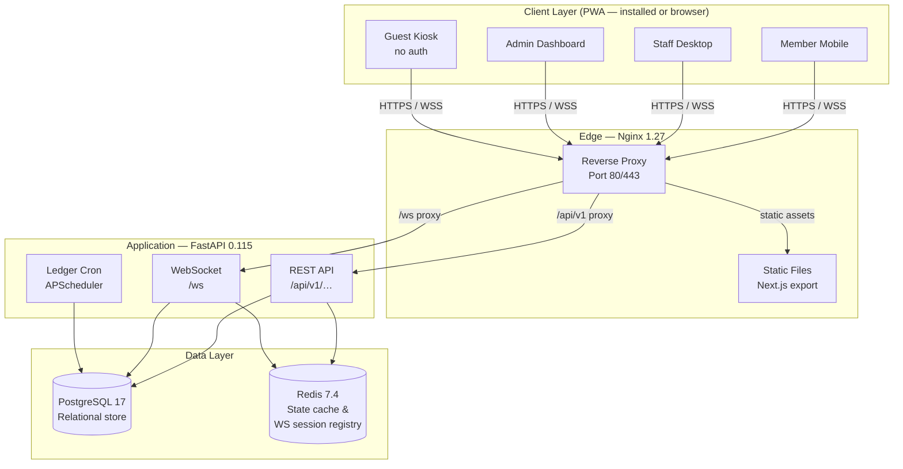
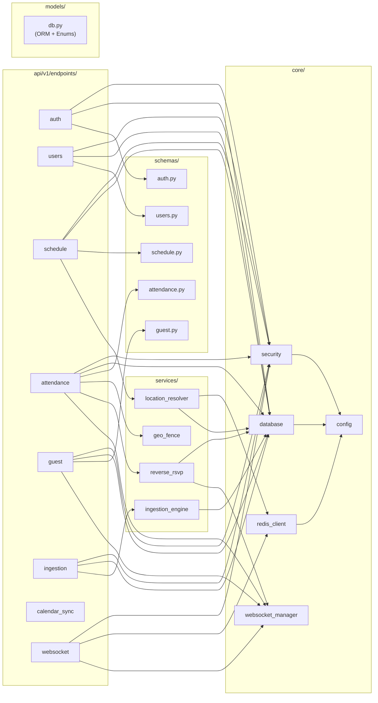
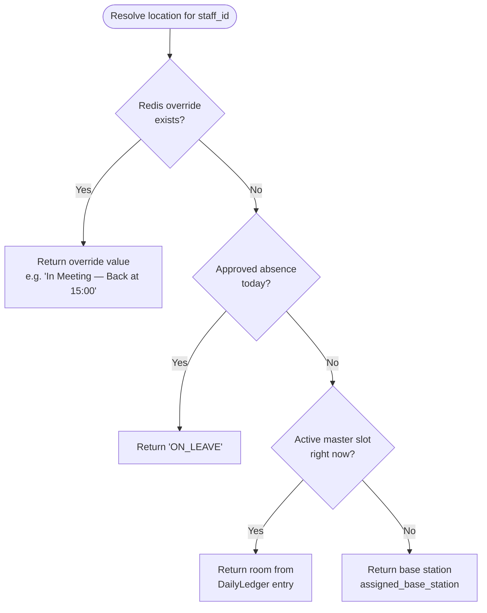
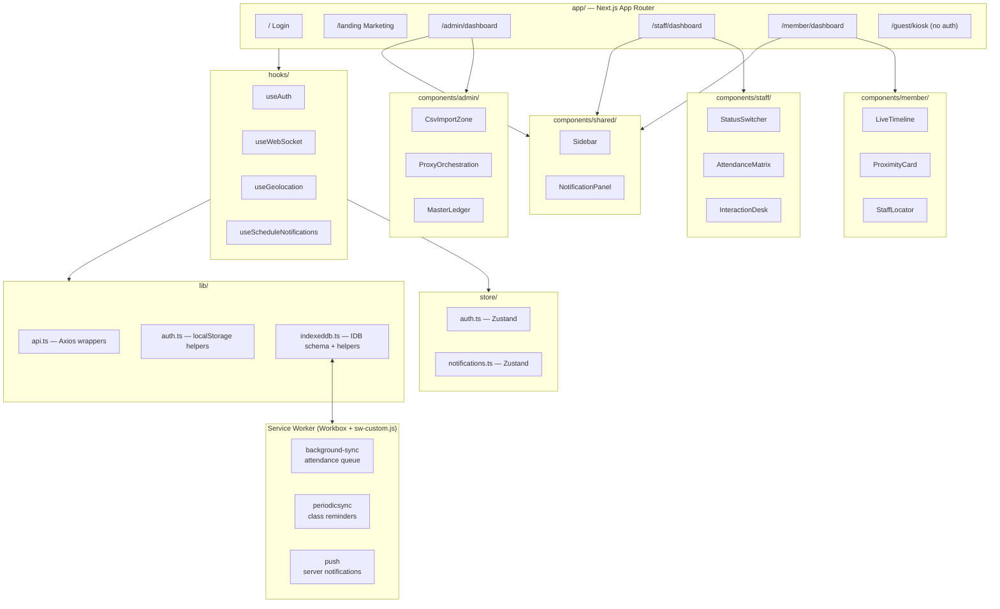

# Architecture

<!-- Copyright 2026 Chronos Ledger Contributors — Apache 2.0 -->

## System Topology



**What each box does**

| Component | Role |
|---|---|
| **Nginx** | TLS termination, gzip, security headers, static file serving, proxy to FastAPI. Serves pre-built Next.js export from the shared `frontend_build` Docker volume. |
| **FastAPI app** | All REST endpoints + WebSocket hub. Single process (uvicorn), stateless beyond DB/Redis. |
| **APScheduler** | Runs `ledger_generator` at midnight UTC to materialise `DailyLedger` rows from `StructuralMasterSlot` for the next day. |
| **PostgreSQL** | Source of truth for all persistent data: users, schedule, attendance, absence logs, guest transactions. |
| **Redis** | Short-lived state: staff status overrides (TTL), in-memory WebSocket connection registry serialised for pub/sub. |

---

## Backend Module Dependency Graph



**Why this layout matters:** Each endpoint module imports from `core/` (infra) and `services/` (domain logic) but never imports another endpoint module. Services are pure domain logic with no HTTP concerns. This makes unit-testing services straightforward without mocking HTTP.

---

## 4-Tier Staff Location Resolution



**Each tier explained:**

1. **Redis override** — A staff member or admin has pushed a manual status via `PATCH /users/{id}/status`. Stored in Redis with an optional TTL. Cleared automatically when TTL expires or manually via the same endpoint.
2. **Daily exception log** — The `ReverseRsvpLog` table is checked for an approved absence on today's date. If found, the ledger entry for that slot is in `ON_LEAVE`.
3. **Master timetable** — The current wall-clock time is compared against `StructuralMasterSlot` time windows. If the staff is in a scheduled session right now, the room from the `DailyLedger` entry is returned.
4. **Base station fallback** — The `assigned_base_station` field on the `User` record (e.g., "Staff Room Block A") is the last-resort answer.

---

## WebSocket Session Lifecycle

```mermaid
sequenceDiagram
    participant C as Client (browser/PWA)
    participant N as Nginx
    participant WS as FastAPI WebSocket
    participant Reg as OrganizationConnectionManager<br/>(in-memory + Redis)

    C->>N: GET /ws?token=<jwt> (Upgrade)
    N->>WS: Proxy WebSocket handshake
    WS->>WS: Validate JWT → extract user_id + role
    WS->>Reg: register(user_id, socket)
    Note over Reg: Stores {user_id → WebSocket} in<br/>process memory; user_id → pid<br/>key written to Redis for future<br/>multi-instance routing

    loop Event loop
        Note over WS,Reg: Domain events trigger broadcast()
        Reg->>C: JSON frame {event, payload}
    end

    C--xWS: Disconnect (tab closed / network drop)
    WS->>Reg: unregister(user_id)
    Reg-->>Redis: Delete user_id key
```

**Why WebSockets instead of polling:** Absence approvals and guest handshakes need sub-second delivery to the staff dashboard. Polling at any sane interval (≥5s) introduces noticeable lag in the two-party guest interaction flow. The connection registry is kept in process memory (fast path) with Redis as the index; this enables adding multi-process fanout later without changing client code.

---

## Frontend Architecture



**Key design choices:**

- **Static export** (`output: 'export'`): The entire frontend is pre-built into static HTML/JS at Docker image build time. Nginx serves it from a shared volume — no Node.js runtime in production, no cold-start latency.
- **Zustand over Redux**: Minimal boilerplate. Auth state and notification inbox are the only global stores; everything else is local component state or server state via Axios.
- **`useSearchParams` Suspense**: Next.js 14 static export requires any component calling `useSearchParams()` to be wrapped in a `<Suspense>` boundary. All three dashboards use an outer default-export wrapper + inner content component pattern.
- **Offline notifications**: Two-layer design — `setTimeout` timers while the page is open (via `useScheduleNotifications`), and `periodicsync` in the service worker for when the device is locked. Both layers deduplicate via the `notified-classes` IndexedDB store.
