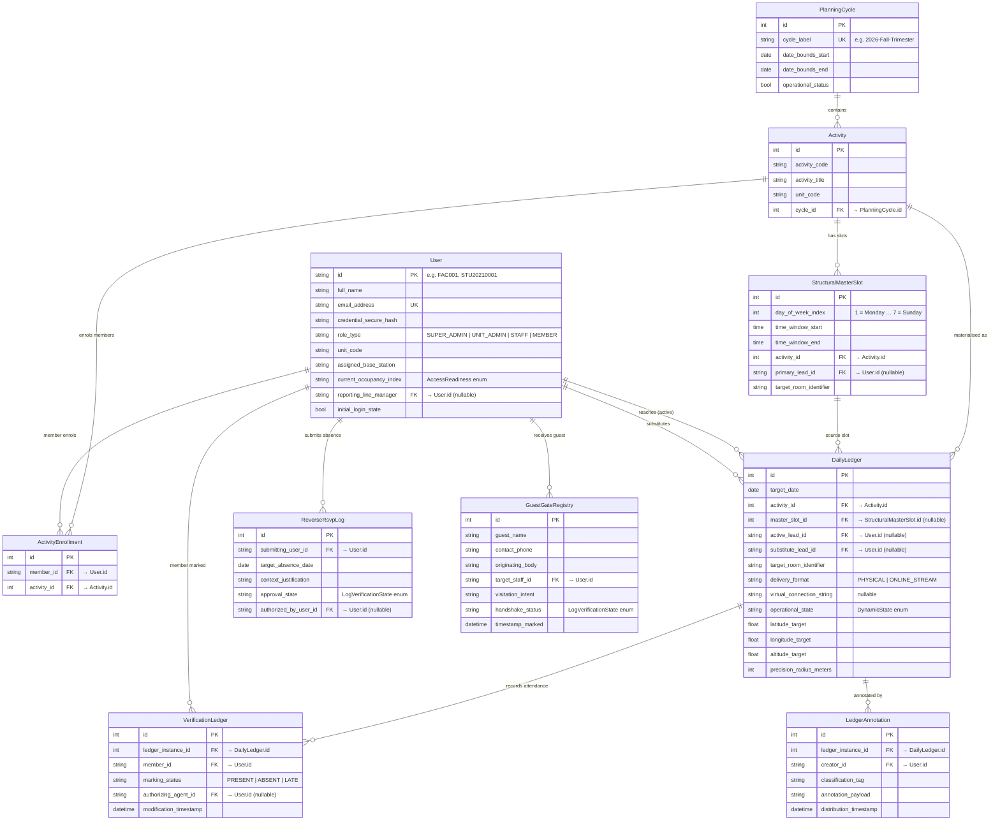

# Data Model

<!-- Copyright 2026 Chronos Ledger Contributors (Apache 2.0) -->

All ten production tables live in the default PostgreSQL `public` schema.
Migrations are managed by Alembic (`backend/alembic/versions/`).

---

## Entity-Relationship Diagram

---

## Table Notes

### `User`
Central identity record. Role-based access is enforced at the API layer (`core/security.py`), not as a DB constraint. The `reporting_line_manager` self-join is used to route absence requests to the correct supervisor.

### `PlanningCycle`
The scheduling container. Only one cycle should have `operational_status = true` at a time; the admin UI enforces this but there is no DB-level unique constraint (allowing a brief overlap during rollover).

### `Activity`
A activity within a cycle. A single activity can appear in multiple cycles as independent `Activity` rows, enabling year-over-year history without aliasing.

### `StructuralMasterSlot`
The repeating weekly timetable entry. `day_of_week_index` follows Python's `date.isoweekday()` convention (1 = Monday, 7 = Sunday), enforced by a CHECK constraint. These are the *template* rows that `ledger_generator` reads each night.

### `ActivityEnrollment`
Member-to-activity enrolment. Created in bulk by `ingestion_engine` during CSV import. No per-term attendance target is stored here, percentage calculations are done at query time.

### `DailyLedger`
The materialised daily schedule. Generated nightly from `StructuralMasterSlot` by `cron/ledger_generator.py`. Contains mutable state: `operational_state` (can be flipped to `ON_LEAVE` by an approved absence), substitute lead, and geofence coordinates (overridable per-session for ad-hoc room changes).

### `VerificationLedger`
One row per member per ledger entry. `authorizing_agent_id` is `null` for self-marks and set to the staff/admin user_id for batch marks. The same row is overwritten on re-mark (upsert logic in `attendance.py`).

### `ReverseRsvpLog`
The Reverse RSVP state machine. Starts at `PENDING_VERIFICATION`. Transition to `VERIFIED_APPROVED` triggers `services/reverse_rsvp.py` which updates the corresponding `DailyLedger.operational_state` to `ON_LEAVE` and broadcasts a WebSocket event to the staff member.

### `GuestGateRegistry`
Records each organization visitor interaction. `handshake_status` transitions from `PENDING_VERIFICATION` → `VERIFIED_APPROVED | VERIFIED_DENIED` when the target staff member acts via the Interaction Desk. The decision is broadcast back to the kiosk via WebSocket.

### `LedgerAnnotation`
Free-form notes attached to a ledger entry (e.g., "lab equipment failure", "class started late"). Used for post-session audits. No schema constraint on `classification_tag`, it's a freeform string at the application layer.
