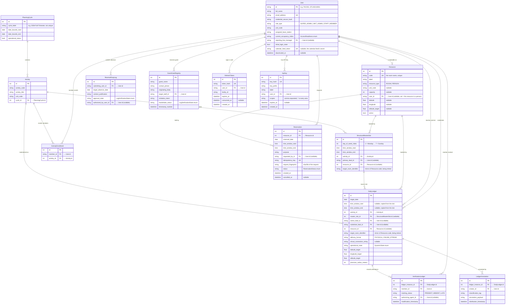

# Data Model

<!-- Copyright 2026 Chronos Ledger Contributors (Apache 2.0) -->

All fourteen production tables live in the default PostgreSQL `public` schema.
Migrations are managed by Alembic (`backend/alembic/versions/`).

---

## Entity-Relationship Diagram

---

## Table Notes

### `User`
Central identity record. Role-based access is enforced at the API layer (`core/security.py`), not as a DB constraint. The `reporting_line_manager` self-join is used to route absence requests to the correct supervisor.

Somebody who leaves is deactivated rather than deleted. `deactivated_at` is set, the account can no longer sign in or be named as a lead, substitute or manager, and every row recorded against it stays.

### `PlanningCycle`
The scheduling container. Several cycles can be open (`operational_status = true`) at once. A slot gets a day only while its cycle is open and the date is inside the cycle's own bounds, so two open cycles covering different parts of the year can use the same room at the same hour, and opening a cycle is refused with `409` where its slots would land on a room already taken on a date both run. `cycle_label` is not unique.

### `Activity`
An activity within a cycle. A single activity can appear in multiple cycles as independent `Activity` rows, enabling year-over-year history without aliasing.

### `Resource`
A thing a reservation consumes. Every room is one row, created on first sight by whichever path names it: `services/resource.py::get_or_create_room` is the only writer, so the importer, `POST /schedule/slots` and the demo seed all resolve to the same row rather than to three spellings of one room.

`code` is unique and deliberately not scoped by unit. Two units both calling a room "101" is a fact about the data that the data cannot resolve, so they are one room rather than a distinction the system invented.

`user_id` marks a resource that is a person, so that staff availability and room availability do not become two mechanisms that drift apart. `latitude`, `longitude` and `altitude_target` are the room's own geofence, as opposed to the per-day override on a `DailyLedger` row.

### `StructuralMasterSlot`
The repeating weekly timetable entry. `day_of_week_index` follows Python's `date.isoweekday()` convention (1 = Monday, 7 = Sunday), enforced by a CHECK constraint. These are the *template* rows that `ledger_generator` reads each night.

### `ActivityEnrollment`
Member-to-activity enrollment. Created in bulk by `ingestion_engine` during CSV import. No per-term attendance target is stored here, percentage calculations are done at query time.

### `DailyLedger`
The materialized daily schedule. Generated nightly from `StructuralMasterSlot` by `cron/ledger_generator.py`. Contains mutable state: `operational_state` (can be flipped to `ON_LEAVE` by an approved absence), substitute lead, and geofence coordinates (overridable per-session for ad-hoc room changes).

`resource_id` is the room. `target_room_identifier` is kept in step with `Resource.code` by every write path so existing readers keep working, and is dropped once they have moved to the key. Correcting a slot's room clears the row's geofence override, because a fence around the room the class has just left would shut out the people who went to the right one.

`master_slot_id` is `ON DELETE SET NULL`, not cascade. A class that ran for six weeks and then stopped is the ordinary reason to delete a slot, and the six weeks have to survive it. `DELETE /schedule/slots/{id}` removes the days from today onward, which are still only plans, and refuses outright if any of them carries attendance or a note; the days already past keep everything recorded on them and are left pointing at no slot. `PATCH /schedule/cycles/{id}/close` removes a cycle's days from today onward the same way, except that it keeps the ones carrying attendance or a note instead of refusing. A detached row keeps its hours: `time_window_start` and `time_window_end` are copied from the slot when the day is generated and again when the slot is corrected (migration 012). A row made without a slot, or one detached before 012, has no window and reads as an all-day event on a calendar feed.

A slot has at most one row per date. Migration 017 puts a unique key on `target_date` and `master_slot_id`, so two runs of the nightly job cannot both write the day, including for a slot with no room, which the overlap constraint from migration 013 does not see. Rows with no slot are not limited by it.

### `VerificationLedger`
One row per member per ledger entry. `authorizing_agent_id` is whoever set the current status: the member for a self-mark, otherwise the lead or admin. The same row is overwritten on re-mark (upsert logic in `attendance.py`).

`member_id` is `ON DELETE RESTRICT` since migration 018, so a user with attendance on file cannot be deleted and is deactivated instead. Before 018 it cascaded, and deleting a user took their attendance with it.

### `ReverseRsvpLog`
The Reverse RSVP state machine. Starts at `PENDING_VERIFICATION` and is routed to the submitter's `reporting_line_manager`, the only person who can decide it. `services/reverse_rsvp.py` applies the decision: `VERIFIED_APPROVED` sets `operational_state` to `ON_LEAVE` and clears the substitute on every `DailyLedger` row the submitter leads on that date, and `VERIFIED_DENIED` puts any of those rows still `ON_LEAVE` back to `SCHEDULED`. The endpoint, not the service, sends the WebSocket frames: `ABSENCE_APPROVAL_REQUIRED` to the manager on submission and `ABSENCE_DECISION` to the submitter on a decision.

### `GuestGateRegistry`
Records each organization visitor interaction. `handshake_status` transitions from `PENDING_VERIFICATION` → `VERIFIED_APPROVED | VERIFIED_DENIED` when the target staff member acts via the Interaction Desk. Nothing is sent back to the kiosk. When `GUEST_RETENTION_DAYS` is set, a daily job deletes the rows older than that many days, whatever their status; 0, the default, keeps them forever.

### `LedgerAnnotation`
Free-form notes attached to a ledger entry (e.g., "lab equipment failure", "class started late"). Used for post-session audits. No schema constraint on `classification_tag`, it's a freeform string at the application layer.

### `Reservation`
A hold on a resource for one date and window. Two `HELD` rows on the same resource cannot overlap: migration 010 adds an exclusion constraint for it, which is Postgres only and so not in the model. Cancelling sets `status` to `CANCELLED` and `cancelled_at` and keeps the row. `idempotency_key` is unique across every resource, and `request_fingerprint` is a SHA-256 of what was asked for, so a retry with the same key and the same request gets the original row back and the same key with a different request is refused.

### `RefreshToken`
One row per refresh token until it expires. Only the SHA-256 hash is stored. A token works once: using it sets `consumed_at` and issues its successor in the same `family_id`, and a sign-in starts a new family. Presenting a used token again ends the whole family. Rows are deleted at logout (the family), at a password change (every family the user has), and a day after expiry by a nightly job.

### `ApiKey`
A long-lived credential for an integration, bound to a user row that acts as its service account. Only the SHA-256 hash is stored, and the raw key is shown once. A request made with the key acts as that user, so role checks and unit scoping apply unchanged. `scopes` is a comma separated list of `<area>:<read|write>` entries, or `*` for every area; `expires_at` null means the key does not expire.
