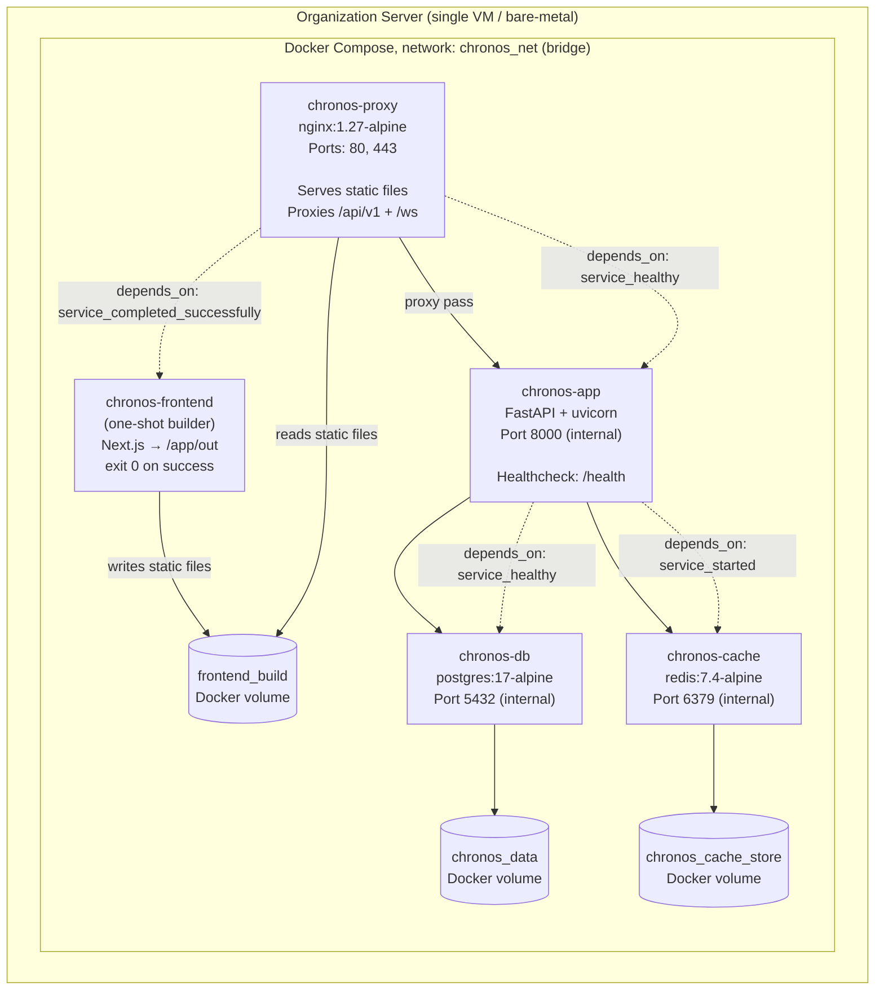
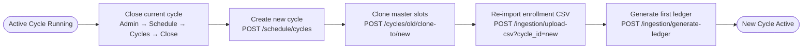

# Deployment Guide

<!-- Copyright 2026 Chronos Ledger Contributors (Apache 2.0) -->

## Prerequisites

| Tool | Minimum Version |
|------|----------------|
| Docker | 24.x |
| Docker Compose | 2.20 |
| Git | 2.x |

For local development additionally:
- Python 3.11+ with [uv](https://github.com/astral-sh/uv)
- Node.js 20 LTS

---

## Docker Compose Topology



**Startup order enforced by `depends_on`:**

1. `chronos-db` starts and passes its healthcheck (`pg_isready`).
2. `chronos-app` starts only after DB is healthy; passes its own `/health` check.
3. `chronos-frontend` build runs (exits 0, writes files to shared volume).
4. `chronos-proxy` (nginx) starts only after both App is healthy **and** the frontend builder has exited successfully. This prevents nginx from serving an empty or partial build.

---

## Production Deployment (Organization Server)

### 1. Prepare the server

```bash
git clone https://github.com/Life-Experimentalist/chronos-ledger.git
cd chronos-ledger
cp .env.example .env
```

Edit `.env` and set:
- `JWT_SECRET_SIGNING_KEY`, generate with `openssl rand -hex 32`. With `APP_ENV=production` the backend refuses to start while this is still the placeholder, is shorter than 32 characters, or `DATABASE_URL` still carries the password from `.env.example`.
- `VAPID_PUBLIC_KEY` / `VAPID_PRIVATE_KEY`, generate with `npx web-push generate-vapid-keys`
- `VAPID_CONTACT_EMAIL`, a reachable admin email
- `DB_PASSWORD`, change from the default before first launch
- `ORG_TIMEZONE`, the IANA name of where the organization is, such as `Asia/Kolkata`. It decides which day the dashboard shows, which day the nightly generator lays down, and when 23:00 is. A container runs UTC, so leaving it unset puts an organization that is not in UTC a whole offset out. An offset like `+05:30` is refused, because it cannot know when daylight saving moves, and a name no zone database knows stops the server rather than falling back quietly.
- `PASSWORD_MIN_LENGTH`, optional, default 12. The shortest password a person may choose, applied to the first-login change and to any account an admin creates with a password they typed. The passwords the system generates for itself, for the CSV importer and for an admin reset, are random and never measured against it. It refuses to go below 8, so the first-login gate cannot be reduced to a formality.
- `RATE_LIMIT_*`, optional. A budget per caller on the three routes where hammering pays: sign-in (10 failures per address and 5 per account, per 15 minutes), the visitor kiosk (300 check-ins per kiosk account per hour) and the calendar feed (60 fetches per feed token per hour). Set any count to 0 to turn that one off, or `RATE_LIMIT_ENABLED=false` for all three. The counters live in Redis, and if Redis is unreachable the limits stop applying rather than the requests failing: it is a cache here, and an instance that cannot see it should keep letting people in.
- `DOCS_ENABLED`, optional, unset. Whether this instance serves `/docs`, `/redoc` and `/openapi.json`. Left blank it follows `APP_ENV`, which the compose files pin to production, so they are off. Set `true` to publish them anyway, which is reasonable on an instance only your own network can reach and is not on one anybody can: every route, field name and enum value of a live deployment is readable from them. The contract lives in `docs/openapi.yaml` either way, so turning them off costs an integrator nothing.
- `FORWARDED_ALLOW_IPS`, optional, default `*`. Which upstream addresses uvicorn will believe `X-Forwarded-For` from. `*` is safe in the shipped stack because the app container publishes no ports and nginx is the only route to it. The sign-in limit depends on it: without it every request arrives from the proxy, the whole organization counts as one caller, and ten failed attempts by one person lock out everybody. Trusting the header is safe here because nginx overwrites `X-Forwarded-For` rather than appending to it, so a caller cannot name its own address and mint a fresh budget for every attempt. If you put another proxy in front of this stack, do not widen this: turn on nginx's realip module in `nginx/chronos-common.conf` (`set_real_ip_from`, `real_ip_header`) so the address nginx sees is the real client.

### 2. Launch with auto-discovery

```bash
chmod +x bin/chronos_intranet_autodiscover.sh
./bin/chronos_intranet_autodiscover.sh
```

This script:
1. Detects the server LAN IP via `ip route`
2. Writes `NEXT_PUBLIC_API_URL` and `NEXT_PUBLIC_WS_URL` to `.env.production`
3. Runs `docker compose up --build -d`

### 3. Verify containers

```bash
docker compose -f docker-compose.prod.yml ps
```

Expected output:
```
NAME                             SERVICE         STATUS          PORTS
chronos-ledger-chronos-proxy-1   chronos-proxy   Up              0.0.0.0:80->80/tcp
chronos-ledger-chronos-app-1     chronos-app     Up (healthy)
chronos-ledger-chronos-db-1      chronos-db      Up (healthy)
chronos-ledger-chronos-cache-1   chronos-cache   Up
```

The container names are compose's own, derived from the directory the stack
runs from, so yours differ if the directory is named something else. Address a
container by its service name through compose rather than by container name;
nothing in the stack pins one.

The proxy's host ports come from `EDGE_HTTP_PORT` and `EDGE_HTTPS_PORT`,
which default to 80 and 443. Set them in `.env` when something else on the
host already owns those ports, or when Chronos is going behind an outer
reverse proxy. The container itself always listens on 80 and 443, so
nothing inside the stack changes.

### 4. First login

Navigate to `http://<server-ip>` and log in as the administrator:

- Email: `admin@org.internal`
- Password: whatever `INITIAL_ADMIN_PASSWORD` says in your `.env`.
  `setup.sh` generates one and prints it once, in its summary.

Nothing can log in as the administrator until that variable is set: the
seed migration stores a hash of a random string it throws away, so there
is no install-wide password to find. **Choose your own before the server
is reachable from any network.** Until you have, the account is refused by
every endpoint except the password change itself, so the first login is
the only thing it can do: use Admin Portal → Profile, or the Onboarding
Wizard, which opens on its own.

---

## Local Development

```bash
# Backend
cd backend
uv sync
cp .env.example .env          # set DATABASE_URL, REDIS_URL, JWT_SECRET_SIGNING_KEY
uv run alembic upgrade head
uv run uvicorn app.main:app --reload --port 8000

# Frontend (separate terminal)
cd frontend
npm install
npm run dev
```

The frontend dev server proxies `/api/v1` to `localhost:8000` via `next.config.js`.
Alembic reads `DATABASE_URL` from the environment, override the `alembic.ini`
default by exporting `DATABASE_URL` before running migrations.

Migration 010 runs `CREATE EXTENSION IF NOT EXISTS btree_gist` before it adds
the constraint that stops two holds overlapping on one resource. On PostgreSQL
13 and later btree_gist is a trusted extension, so the database owner can
install it and no superuser is involved. On an older server, or on a managed
host that restricts extensions, run `CREATE EXTENSION btree_gist;` once as a
superuser against the target database and then run the migration again.

---

## Planning Cycle Rollover



### Step-by-step

1. **Close the active cycle**: Admin Portal → Schedule → Cycles → `Close Cycle`, or:
   ```sql
   UPDATE planning_cycles SET operational_status = false WHERE id = <current_id>;
   ```
2. **Create the new cycle**: Admin Portal → New Cycle or `POST /api/v1/schedule/cycles`:
   ```json
   { "cycle_label": "2026-Fall-Trimester", "date_bounds_start": "2026-09-01",
     "date_bounds_end": "2026-12-20", "operational_status": true }
   ```
3. **Clone master slots**, copies all `StructuralMasterSlot` rows (not enrollment or attendance):
   ```
   POST /api/v1/schedule/cycles/{old_id}/clone-to/{new_id}
   ```
4. **Re-import CSV**, upload the new term's enrollment sheet to assign members and update leads.
5. **Generate first ledger**, trigger ledger generation for the first day of the new cycle:
   ```
   POST /api/v1/ingestion/generate-ledger   { "target_date": "2026-09-01" }
   ```

---

## Database Backup

The maintenance script runs automated integrity checks and backups:

```bash
chmod +x bin/chronos_maintenance_vault.sh
./bin/chronos_maintenance_vault.sh
```

Schedule via cron for nightly runs:

```cron
0 2 * * * /path/to/chronos-ledger/bin/chronos_maintenance_vault.sh >> /var/log/chronos_maintenance.log 2>&1
```

---

## TLS / HTTPS

TLS is switched on by mounting certificates, not by editing configuration.
At container start, `40-tls.sh` (in `/docker-entrypoint.d/`) checks for a
certificate pair and enables the HTTPS listener on `:443` only when both
files exist:

```
certs/
  fullchain.pem
  privkey.pem
```

With no certificates the same image serves plain HTTP on `:80` and logs
`serving HTTP only`. With them it serves both, logs `HTTPS enabled on :443`,
and sends `Strict-Transport-Security` on HTTPS responses only (HSTS is never
emitted over plain HTTP). Both listeners share one config body
(`nginx/chronos-common.conf`), so they cannot drift apart.

### Getting certificates with certbot (Let's Encrypt)

On the host, with DNS for your domain pointing at the server:

```bash
# Stop the proxy briefly so certbot can bind :80
docker compose stop chronos-proxy
sudo certbot certonly --standalone -d chronos.example.edu

# Copy into the mounted certs/ directory (paths per certbot output)
sudo cp /etc/letsencrypt/live/chronos.example.edu/fullchain.pem certs/
sudo cp /etc/letsencrypt/live/chronos.example.edu/privkey.pem certs/

docker compose start chronos-proxy
```

The proxy logs confirm which mode it started in:

```bash
docker compose -f docker-compose.prod.yml logs chronos-proxy | grep 40-tls
```

### Renewal

Let's Encrypt certificates last 90 days. Add a monthly cron entry that
renews, refreshes the copies, and restarts the proxy so nginx re-reads them.
Use certbot's own hooks rather than a shell `&&` chain: `--post-hook` runs
after every renewal attempt (success or failure), so the proxy always comes
back up even when certbot errors, and `--deploy-hook` runs only when a new
certificate was actually issued.

```cron
0 3 1 * * certbot renew --pre-hook "docker compose -f /path/to/chronos-ledger/docker-compose.prod.yml stop chronos-proxy" --deploy-hook "cp /etc/letsencrypt/live/chronos.example.edu/fullchain.pem /path/to/chronos-ledger/certs/ && cp /etc/letsencrypt/live/chronos.example.edu/privkey.pem /path/to/chronos-ledger/certs/" --post-hook "docker compose -f /path/to/chronos-ledger/docker-compose.prod.yml start chronos-proxy"
```

Cron runs with a minimal `PATH`; if `docker` or `certbot` is not found, use
absolute paths (`/usr/bin/docker`, `/usr/bin/certbot`) or set
`PATH=/usr/local/bin:/usr/bin:/bin` at the top of the crontab.

### After enabling HTTPS

- Update `.env` `APP_CORS_ORIGINS` to the `https://` URL.
- Rebuild the frontend image if you override `NEXT_PUBLIC_API_URL` or
  `NEXT_PUBLIC_WS_URL` with absolute URLs (the defaults are relative paths,
  which follow the page origin and need no rebuild).
- Optional: to force all traffic onto HTTPS, replace the body of the `:80`
  server in `nginx/nginx.conf` with `return 301 https://$host$request_uri;`.
  This is not the default because the container healthcheck and internal
  probes use plain HTTP on localhost.

---

## Scaling

The FastAPI layer is stateless beyond DB/Redis. To scale horizontally:

1. Add Redis Pub/Sub broadcasting to `OrganizationConnectionManager` so WebSocket events fanout across multiple app instances.
2. Place a load balancer in front of the app containers (sticky sessions not required once Pub/Sub is implemented: WS connections land on any instance and receive events via Redis).
3. The PostgreSQL connection pool (`pool_size=10`, `max_overflow=20` in `core/database.py`) handles typical single-organization loads without change.
