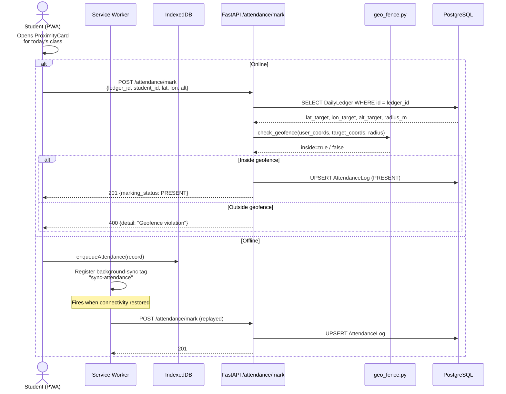
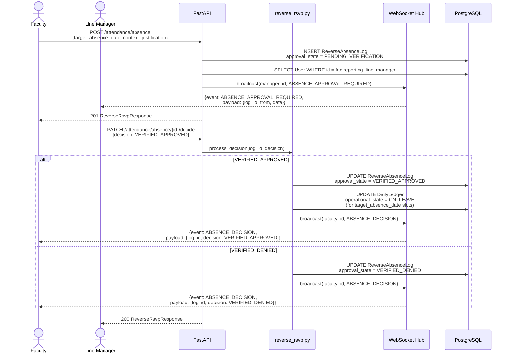
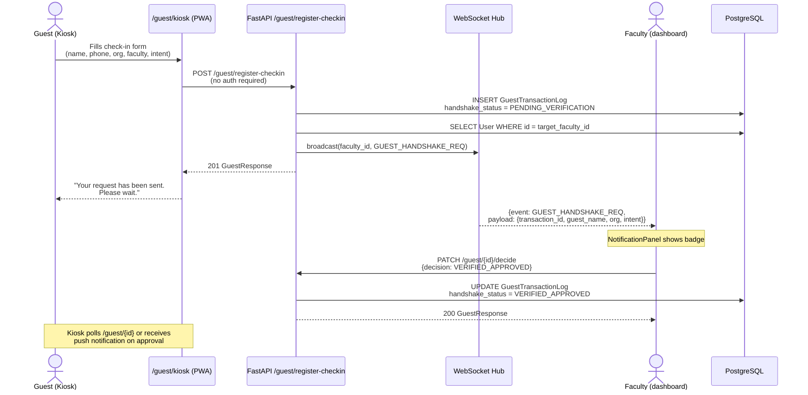
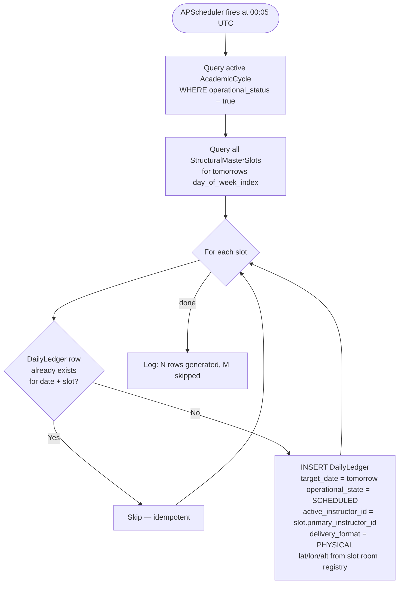

# Key Flows

<!-- Copyright 2026 Chronos Ledger Contributors — Apache 2.0 -->

Sequence diagrams for the four core interaction flows. Each diagram is followed
by a plain-English walk-through of every significant step.

---

## 1. Student Attendance Marking (Geofenced)

**Step-by-step:**

1. The student opens the **ProximityCard** component which starts a GPS watch via `useGeolocation.ts`. The hook calls `navigator.geolocation.watchPosition` (stable `useRef` for the watch ID — fixes a prior bug where a plain object was used).
2. **Online path**: Coordinates + ledger ID are posted to `/attendance/mark`. The backend queries the `DailyLedger` row for the geofence target coordinates and calls `geo_fence.check_geofence()`. The function runs a Haversine 2D distance check then validates `|user_alt - target_alt| < 4m` to prevent students on adjacent floors from registering.
3. If the check passes, an `AttendanceLog` row is upserted (idempotent — re-marking is allowed, last write wins).
4. **Offline path**: The mark is written to the `attendance-queue` IndexedDB store. The service worker's `background-sync` tag `sync-attendance` is registered. On reconnect, the SW replays the queue to `/attendance/mark` and clears the store entry on 2xx response.

---

## 2. Faculty Absence Request (Reverse RSVP)

**Step-by-step:**

1. Faculty submits an absence request via the **Absence Requests** tab. The `ReverseAbsenceLog` row is created with `approval_state = PENDING_VERIFICATION`.
2. The API immediately resolves the faculty's `reporting_line_manager` user ID and broadcasts a `ABSENCE_APPROVAL_REQUIRED` WebSocket event. If the manager is connected, they see a notification badge in real time.
3. The manager opens **Pending Approvals** and approves or denies.
4. On approval, `services/reverse_rsvp.py` updates every `DailyLedger` entry on the target date where the faculty is `active_instructor_id` to `operational_state = ON_LEAVE`. This cascades the absence into the live schedule.
5. A `ABSENCE_DECISION` WebSocket event is sent to the faculty member so they see the outcome immediately without polling.

---

## 3. Guest Handshake

**Step-by-step:**

1. The **Guest Kiosk** (`/guest/kiosk`) is a public, unauthenticated page accessible from any campus terminal. It searches the faculty directory (`GET /guest/directory?name=…`) to let the guest pick the right person.
2. The check-in POST requires no bearer token. The server creates a `GuestTransactionLog` row and immediately pushes a `GUEST_HANDSHAKE_REQ` frame to the target faculty's WebSocket connection.
3. If the faculty is connected, their **NotificationPanel** badge increments and the **Interaction Desk** tab shows the incoming request within milliseconds.
4. Faculty approves or declines. The `GuestTransactionLog` row is updated and the decision is broadcast back. The kiosk can display the outcome to the guest.

---

## 4. Nightly Ledger Generation

**Step-by-step:**

1. APScheduler (configured in `backend/app/main.py`) triggers `cron/ledger_generator.generate_tomorrow_ledger()` at 00:05 UTC daily.
2. The active `AcademicCycle` is queried. If none is active (e.g., semester break), the job is a no-op.
3. For tomorrow's `day_of_week_index`, all `StructuralMasterSlot` rows for that day are fetched.
4. For each slot, an existence check is performed. This makes the job fully **idempotent** — safe to re-run manually via `POST /ingestion/generate-ledger` without creating duplicates.
5. New rows are inserted with `operational_state = SCHEDULED` and the slot's instructor. Faculty/admins can subsequently mutate the row (substitute instructor, delivery format, geofence coords) via `PATCH /schedule/ledger/{id}`.
